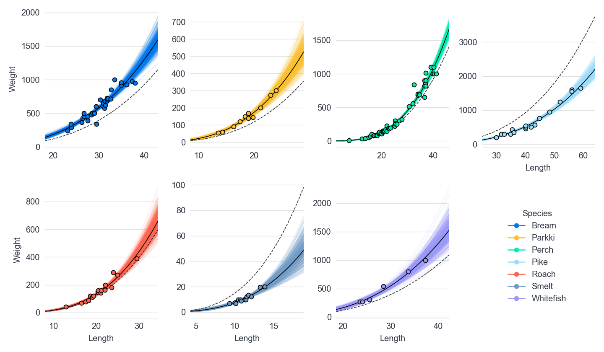
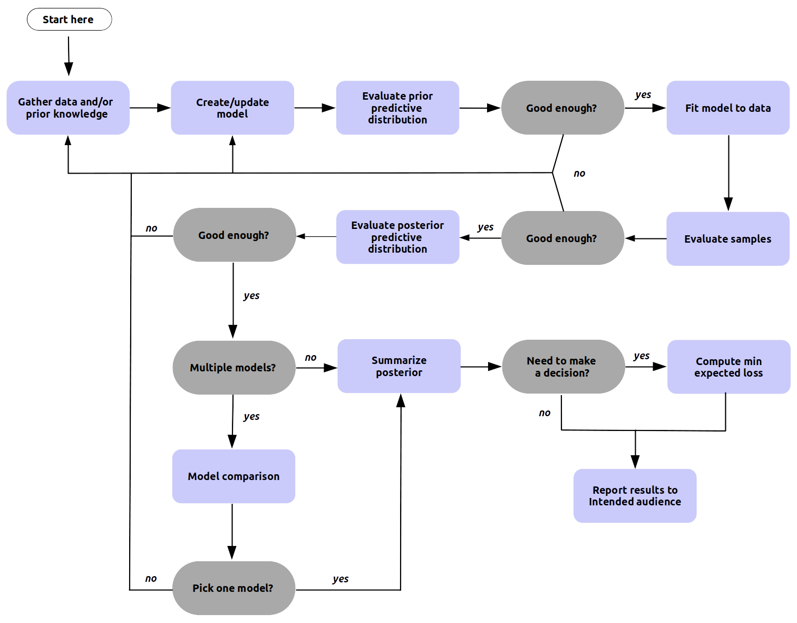
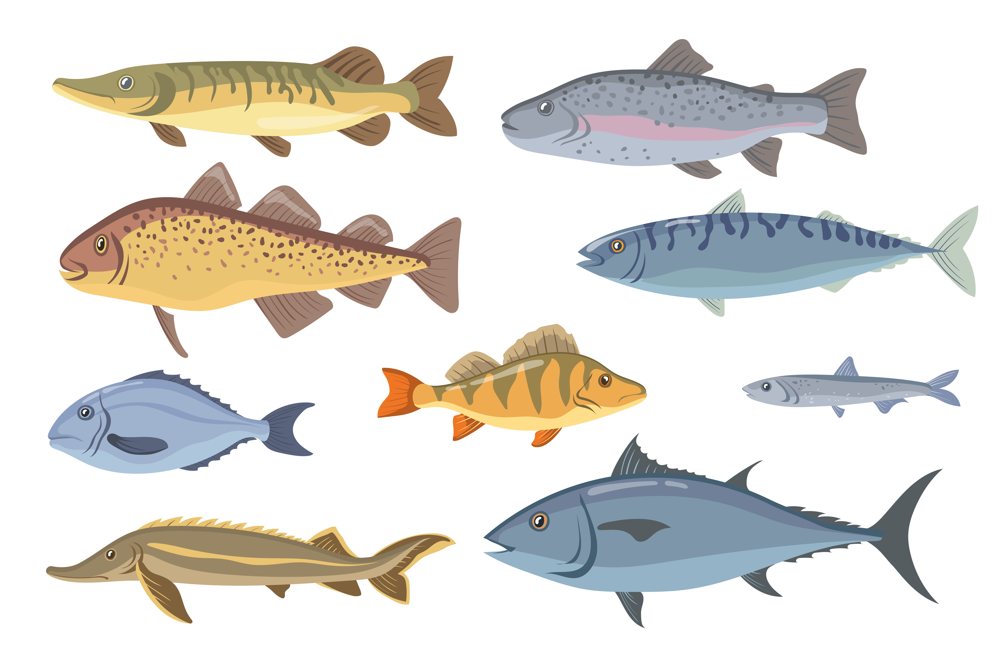

---
jupyter:
  jupytext:
    formats: ipynb,md
    text_representation:
      extension: .md
      format_name: markdown
      format_version: '1.3'
      jupytext_version: 1.14.1
  kernelspec:
    display_name: Python 3 (ipykernel)
    language: python
    name: python3
---

<!-- #region hide_input=false slideshow={"slide_type": "slide"} -->
# Bayesian Regression Refresher
<!-- #endregion -->

```python hide_input=false slideshow={"slide_type": "skip"}
import arviz as az
import matplotlib as mpl
import matplotlib.pyplot as plt
import numpy as np
import pandas as pd
import pymc as pm
import seaborn as sns

from matplotlib.lines import Line2D
from matplotlib.patches import  FancyArrowPatch
```

```python slideshow={"slide_type": "skip"}
%matplotlib inline
plt.style.use("intuitivebayes.mplstyle")

mpl.rcParams["figure.dpi"] = 120
mpl.rcParams["figure.facecolor"] = "white"
mpl.rcParams["axes.spines.left"] = False
FIGSIZE = (12, 7)
```

<!-- #region slideshow={"slide_type": "slide"} -->
## The setting

<center>
  
</center>
<!-- #endregion -->

<!-- #region slideshow={"slide_type": "notes"} -->
In this lesson, we'll imagine we are working in the data science team of an e-commerce company. In particular, we sell really good and fresh fish to our clients (mainly fancy restaurants).

<!-- #endregion -->

<!-- #region slideshow={"slide_type": "slide"} -->
## The problem

* We can't weigh each fish individually
* The weight of the fish is critical information for the business we operate in
* Is there a way to estimate the weigh of a fish from a picture?
  * We have historical data on fish dimensions and weight
<!-- #endregion -->

<!-- #region slideshow={"slide_type": "notes"} -->

When we ship our products, there is a very important piece of information we need: **the weight of the fish**. Why? First, because we bill our clients according to weight. Second, because the company that delivers the fish to our clients has different price tiers for weights, and those tiers can get really expensive. So we want to know the probability of an item being above that line. In other words, estimating uncertainty is important here!
<!-- #endregion -->

<!-- #region slideshow={"slide_type": "slide"} -->
## Spoilers, Yes there are

<center>
  
</center>
<!-- #endregion -->

<!-- #region slideshow={"slide_type": "notes"} -->
Surprise! We thought it would be nice to reveal just a little bit of the model we'll have built by the end of this lesson. 

This chart, which was made with lots of love, shows the relationship between fish length and weight, for each species. On top of that, there are the estimated regression curves, properly accounting for uncertainty using the whole posterior.

But if you're too surprised about what we are seeing because it looks so confusing, it may indicate that you could take the Introductory Course before moving forward with Advanced Regression. This lesson is meant to be a review and complement to what was already covered there and most of the content should look familiar already.
<!-- #endregion -->

<!-- #region slideshow={"slide_type": "slide"} -->
## We'll cover more than linear regression

1. Build a model step-by-step based on evidence
<!-- #endregion -->

<!-- #region slideshow={"slide_type": "fragment"} -->
2. Fit the model using the Bayesian approach
<!-- #endregion -->

<!-- #region slideshow={"slide_type": "fragment"} -->
3. Predict while accounting for uncertainty
<!-- #endregion -->

<!-- #region slideshow={"slide_type": "fragment"} -->
4. Communicate in the language the business cares about
<!-- #endregion -->

<!-- #region slideshow={"slide_type": "slide"} -->
## Exploratory Data Analysis
* Why it's critical to look at your data no matter what kind of model you're building
<!-- #endregion -->

<!-- #region slideshow={"slide_type": "slide"} -->
## Making a plan
* Anticipate what's coming
<!-- #endregion -->

<!-- #region slideshow={"slide_type": "slide"} -->
## The worlds simplest model
* Plotting the straightest line
* The thing that most average people forget about linear regression
<!-- #endregion -->

<!-- #region slideshow={"slide_type": "slide"} -->
## Adding a covariate
* Taking into account other measures of the fish
<!-- #endregion -->

<!-- #region slideshow={"slide_type": "slide"} -->
## Transformations

* The key to make linear modeling really flexible
<!-- #endregion -->

<!-- #region slideshow={"slide_type": "slide"} -->
## Accounting for the species

* Making our model aware not all fish are the same
<!-- #endregion -->

<!-- #region slideshow={"slide_type": "slide"} -->
## When we catch more fish

* Using our model to predict the weight of new fish
<!-- #endregion -->

<!-- #region slideshow={"slide_type": "slide"} -->
## From predictions to insights

* Learning how to communicate results to the business
<!-- #endregion -->

<!-- #region slideshow={"slide_type": "slide"} -->
## Bayesian Workflow and Growing Pains

* Making our model bigger in a principled way
<!-- #endregion -->

<!-- #region slideshow={"slide_type": "slide"} -->
## Section recap

* We are an e-commerce company that needs to know the weights of fish, without being able to directly weigh each fish immediately
* We will use size measurements together with a Bayesian Linear model to estimate weight
* Bayesian linear regression helps us:
    * Estimate a plausible range of costs
    * Determine all possible impacts on the bottom line, not just the most likely one
    * Communicate our results in the language business cares about
<!-- #endregion -->

<!-- #region slideshow={"slide_type": "notes"} -->
In this lesson you're not only learning linear regression, you're learning about how to estimate linear regression, and most importantly the thought process of creating a generative model and the workflow to do so. This one idea alone will put you far ahead of the "predict and pray" data scientists that mainly overfit models.

The beauty of the Bayesian framework is that you can incorporate the model estimates directly into the decision making process, considering all plausible scenarios and not only the most likely one.

Cherry on the cake, it also allows you - the modeler - to communicate your results in the only language business cares about -- money, money, money, as Abba would say.
<!-- #endregion -->

<!-- #region slideshow={"slide_type": "notes"} -->
None of this should feel new.

 This lesson is meant to be a review and complement to what was already covered there and most of the content should look familiar already. If you're too surprised about what we are seeing because it looks so confusing, it may indicate that you could take the Introductory Course before moving forward with Advanced Regression. We'll provide some resources if you prefer self learning
<!-- #endregion -->

<!-- #region slideshow={"slide_type": "slide"} -->
# Exploratory Data Analysis
Building a map for what we're going to model
<!-- #endregion -->

<!-- #region slideshow={"slide_type": "slide"} -->
## Our challenge is just starting


<center>
  
</center>
<!-- #endregion -->

<!-- #region slideshow={"slide_type": "notes"} -->
We start a challenging adventure. We want to fit a linear regression model to predict the weight of fish. We know this is going to be extremely valuable to our company and we can't wait to get this rolling.
<!-- #endregion -->

<!-- #region slideshow={"slide_type": "slide"} -->
## Is linear regression the right choice?
<!-- #endregion -->

<!-- #region slideshow={"slide_type": "notes"} -->
But, how do we know we can fit a linear model to a dataset? Well, some may say won't ask that question and will blindly fit models to data.

And while that's a valid approach that may end up working sometimes, we know we can do something smarter.

<!-- #endregion -->

<!-- #region slideshow={"slide_type": "slide"} -->
## You need to look at the data

<center>
  
</center>
<!-- #endregion -->

<!-- #region slideshow={"slide_type": "notes"} -->
A better approach is to first get started by doing Exploratory Data Analysis (EDA). This will give us lots of valuable information about our dataset _before_ doing any modeling. 

Some of you may roll your eyes and say "I came here to learn Bayesian Stats!". We know it may sound boring. Believe us, EDA will help you be a better statistician. By the end of the course, you won't only know how to do Bayesian modeling, you'll also know what's the right tool for a given situation and why it works the way it does.
<!-- #endregion -->

<!-- #region slideshow={"slide_type": "slide"} -->
## Loading our fish data
<!-- #endregion -->

```python
data = pd.read_csv("data/fish-market.csv")
data
```

<!-- #region slideshow={"slide_type": "notes"} -->
Let's get started by exploring the data our team shared with us. There's the CSV file we need to load. As usual, we let the very handy `read_csv()` function do the work for us.

Great! We now have the data loaded. We see we have 159 observations and 7 variables. Each observation represents a single fish, so there are 159 different fish in total. We can try to figure out the meaning of the columns by their names, but it's better to check out the description provided with the data.
<!-- #endregion -->

<!-- #region slideshow={"slide_type": "skip"} -->
## Column Overview

<center>

| **Name** | **Description**                     |
|:--------:|-------------------------------------|
|  Species | Species name of fish                |
|  Weight  | Weight of fish in grams (g)         |
|  Length1 | Vertical length in centimeters (cm) |
|  Length2 | Diagonal length in centimeters (cm) |
| Length3  | Cross length in centimeters (cm)    |
| Height   | Height in centimeters (cm)          |
| Width    | Diagonal width in centimeters (cm)  |

</center>
<!-- #endregion -->

<!-- #region slideshow={"slide_type": "slide"} -->
## Deeper dive
<!-- #endregion -->

```python slideshow={"slide_type": "-"}
data.info()
```

<!-- #region slideshow={"slide_type": "notes"} -->
For each fish we have the its species, weight, height, width, and not one, not two, but three (!) different length measurements. 

Let's now check the column types and whether there are any missing values.

So far so good! Pandas let us know that all the columns have the appropriate data type and none of them have missing values.
<!-- #endregion -->

<!-- #region slideshow={"slide_type": "slide"} -->
## Summary statistics
<!-- #endregion -->

```python slideshow={"slide_type": "-"}
data.describe().round(2)
```

<!-- #region slideshow={"slide_type": "notes"} -->
The next step is to compute some basic summaries. We can get started with the numeric variables in the dataset. These simple aggregations are very powerful and give us quick and valuable information. For example:

* Fish weight ranges from 0, goes up to 1650 grams, and averages 400 grams. We can conclude we're working with small to medium sized fish.
* Weight variability is quite high. Its standard deviation is quite close to the mean. In other words, fish are quite different in terms of weight.

Shoot! Have a look at the summary table again. Can you spot any unexpected result? 

The minimum weight is zero (!). Have you ever seen anything on earth that weighs exactly zero? I haven't been that lucky, so it must be an error. Maybe the fish was too small for the scale to notice it, or there was a mistake somehow during data collection. 

For the lesson purposes is safe to ignore that record so we simply discard it.
<!-- #endregion -->

```python slideshow={"slide_type": "fragment"}
data = data[data["Weight"] > 0].reset_index(drop=True)
print(data["Weight"].min())
```

<!-- #region slideshow={"slide_type": "notes"} -->
It turns out that the smallest fish weights only 5.9 grams.

It feels a bit weird to have three columns for the length of the fish. These probably encode the same information so there's no point in keeping all of them. Let's explore the correlation among them to see if we can confirm our intuition.
<!-- #endregion -->

<!-- #region slideshow={"slide_type": "slide"} -->
## Linear Correlation 
<!-- #endregion -->

```python slideshow={"slide_type": "-"}
corr = data[["Length1", "Length2", "Length3"]].corr()
corr.style.background_gradient(cmap="coolwarm")
```

<!-- #region slideshow={"slide_type": "notes"} -->
Bingo! The three length measurements are extremely correlated. So, without more information about their differences, we should just arbitrarily drop two of them as they provide virtually the same information. 
<!-- #endregion -->

<!-- #region slideshow={"slide_type": "slide"} -->
## Dropping the extra columns
<!-- #endregion -->

```python slideshow={"slide_type": "-"}
data = data.drop(["Length2", "Length3"], axis="columns")
data.head()
```

<!-- #region slideshow={"slide_type": "notes"} -->
We drop the extra columns to make this tidy and remove the correlated columns.
<!-- #endregion -->

<!-- #region hide_input=true slideshow={"slide_type": "slide"} -->
## How frequent species are?
<!-- #endregion -->

```python hide_input=true slideshow={"slide_type": "-"}
species_n = data["Species"].value_counts()
species_pct = (100 * species_n / species_n.sum()).round(2)

fig, ax = plt.subplots(figsize=FIGSIZE)
color = [f"C{i}" for i in range(len(species_n))]
ax.bar(species_n.index, species_n, color=color)
for i, n in enumerate(species_n):
    ax.text(i, n + 0.5, str(n), size=16, ha="center", va="bottom")
ax.set(xlabel="Species", ylabel="Number of fish", title="Number of fish by species");
```

<!-- #region slideshow={"slide_type": "notes"} -->
We have gained lots of insights so far and that's aswesome. But we're still missing key part: the species. It's time to show off our data visualization skills!

We can get started by exploring the number of records we have for each species using a barchart.

The first thing we notice is the height of the bars are quite different. This means the number of records per species varies a lot. The most common species is (by far) Perch and it has 56 records. Other species appear less frequently. Perkki and Whitefish are the most extreme cases with 11 and 6 records only.
<!-- #endregion -->

<!-- #region slideshow={"slide_type": "slide"} -->
## Table Summary
<!-- #endregion -->

```python hide_input=false slideshow={"slide_type": "-"}
pd.concat(
    [species_n, species_pct, species_pct.cumsum()], 
    axis=1, 
    keys=["Count", "Percentage (%)", "Cumulative Percentage (%)"]
).rename_axis("Species").reset_index()
```

<!-- #region slideshow={"slide_type": "notes"} -->
In this table view, we see the top-two species together make up around 60% of the fish in the data. That's quite a lot! To have an idea of how are the differences between species, we can compare Perch with Whitefish and see Perch is 10 times more common than Whitefish. That's a huge difference!
<!-- #endregion -->

<!-- #region slideshow={"slide_type": "slide"} -->
## What's the weight of fish?
<!-- #endregion -->

```python hide_input=true slideshow={"slide_type": "-"}
fig, ax = plt.subplots(figsize=FIGSIZE)
ax.hist(data["Weight"], ec="C0", alpha=0.85, bins=30)
ax.set(xlabel="Weight (grams)", ylabel="Count", title="Distribution of fish weight");
```

<!-- #region slideshow={"slide_type": "notes"} -->
We already got some insights about the weight. For example, we know the average fish weighs 400 grams. But that doesn't mean that 400 grams is a good number to represent all the fish! 

As Bayesians, we love distributions. So why not see the entire distribution as well?

Here we see taller bins for lower weights and shorter ones for higher weights. In other words, smaller weights are more common. 

As you may recall from the Introductory Course, when a distribution has this shape it is said it is a right-skewed distribution (because it has a long tail on the right side). So the distribution of weights is right-skewed.
<!-- #endregion -->

<!-- #region slideshow={"slide_type": "slide"} -->
## Plotting percentiles
<!-- #endregion -->

```python hide_input=true slideshow={"slide_type": "-"}
percentage = 0.8
quantile = data["Weight"].quantile(percentage)
text_y = 28
text_x_pad = 10

fig, ax = plt.subplots(figsize=FIGSIZE)
ax.hist(data["Weight"], ec="C0", alpha=0.85, bins=30)
ax.text(
    quantile + text_x_pad, 
    text_y, 
    f"{round(quantile)}gm ({round(percentage * 100)}% percentile)",
    size=14,
    va="top", 
    ha="left"
)
ax.vlines(quantile, 0, text_y, color="C1")
ax.set(xlabel="Weight (grams)", ylabel="Count", title="Distribution of fish weight");
```

<!-- #region slideshow={"slide_type": "notes"} -->
And that's not all folks! We can also add extra layers of information. For example, we can visualize percentiles on top of the distribution to get richer insights.
 
We overlay the 80% percentile and it confirms with numbers what we've been seeing so far: the dataset contains mostly small fish. 8 out of 10 fish in the data weigh 700 grams or less!
<!-- #endregion -->

<!-- #region slideshow={"slide_type": "slide"} -->
## How does weight vary from species to species?
<!-- #endregion -->

```python hide_input=true slideshow={"slide_type": "-"}
plot_data = data.groupby("Species")["Weight"].describe()
species_list = data["Species"].unique()

fig, ax = plt.subplots(figsize=FIGSIZE)

for i, species in enumerate(species_list):
    row = plot_data.loc[species]
    ax.scatter(row["50%"], i, s=100)
    ax.hlines(i, xmin=row["25%"], xmax=row["75%"], lw=5.2, color=f"C{i}")
    ax.hlines(i, xmin=row["min"], xmax=row["max"], lw=3.2, color=f"C{i}")
    ax.text(1750, i, f"n={round(row['count'])}", ha="left")

ax.set_yticks(np.arange(i + 1), species_list)
ax.set(xlabel="Weight (grams)", ylabel="Species", title="Fish weight by species");
```

<!-- #region slideshow={"slide_type": "notes"} -->
There's a related question we need to ask: Is the weight of the fish related to the species? In a more intuitive way, does knowing the species help us make a better guess of the fish weight? 

Our intuition and experience suggest so. But, we have data, right? So let's use it!

* How to read the chart
    * The dot represents the median weight
    * The thicker line represents 25% and 75% percentiles
    * The thinner line represents the minimum and the maximum values

As we expected, weight varies from species to species. Some species are similar (see Whitefish and Bream) and some others are waaay different (see Pike and Smelt). The spread of these distributions is different as well. For example, Parkki fish have very similar weights, while Bream varies a lot more.

The **main takeaway** is that the species is something we need to really consider when building our regression model. We expect to adjust weight predictions based on the species. If a model predicts the same weight for all fish no matter the species, well, that's a red flag! It's inconsistent with what we've just found.

So great to have this figured out! Thanks very much EDA!
<!-- #endregion -->

<!-- #region slideshow={"slide_type": "slide"} -->
## Relationship among fish measurements
<!-- #endregion -->

```python hide_input=false slideshow={"slide_type": "fragment"}
sns.pairplot(data, vars=["Length1", "Height", "Width", "Weight"], diag_kws={"bins": 30});
```

<!-- #region slideshow={"slide_type": "notes"} -->
We've been doing an intensive exploration so far. It's been exciting and insightful! Now we are in a much better position to start building our model. We know much more about the weight of the fish and how it varies from species to species. That's awesome!

On top of that, we have information about several other charactersitics of the fish like the length, height, and width. If we had to guess we would say longer, taller, and wider fish weigh more, right? That's pretty reasonable form a biological (and why not, culinary) perspective.

But we have data, folks! Let's use it!

The chart confirm our guess was right. All the variables are positively associated. Larger values of one variable are associated with larger values of the other. For example, longer fish are usually taller, wider, and heavier.

There's a another very interesting finding here. Some relationships are linear, while others are not. For example, Height and Width show a linear pattern, but Height and Weight don't.

What's even more curious is there seems to be clouds of points that are very well separated from each other. What can this be? Let's double-click on it!
<!-- #endregion -->

<!-- #region slideshow={"slide_type": "slide"} -->
### Relationship among fish measurements
<!-- #endregion -->

```python slideshow={"slide_type": "-"}
sns.pairplot(data, vars=["Length1", "Height", "Width", "Weight"], hue="Species");
```

<!-- #region slideshow={"slide_type": "notes"} -->
Bingo! Once we map the species to the color of the dots we see clusters with dots of the same color. How can we read it? Length, height, and width are quite informative about the weight of the fish. But, on top of that, knowing the species adds even more information!

This is so exciting! We started from nothing and after all this work we have so much information about our data! I cannot to start using all of this in our model!
<!-- #endregion -->

<!-- #region slideshow={"slide_type": "slide"} -->
## Section Recap
* Exploratory Data Analysis is recommended essential
    * Proper EDA  is what separates mediocre data practitioners and data scientist from great ones
    * Becomes more necessary when we get to advanced models
* In our fish data we noticed
    * Longer fish weigh more
    * Noted some non-linear relations
    * Species is an important feature we'll need to consider 
<!-- #endregion -->

<!-- #region slideshow={"slide_type": "slide"} -->
# Making a plan
Higher probability of a good modeling results when we use informed priors
<!-- #endregion -->

<!-- #region slideshow={"slide_type": "slide"} -->
## Planning takes thought

<!-- #endregion -->

<center>
  
</center>

<!-- #region slideshow={"slide_type": "notes"} -->
We already gained lots of insights about the fish. This puts us in a much better position to start modeling. We have quite strong priors to judge if model inferences make sense or not. That's the power of Exploratory Data Analysis!

We have one last job to do: we're making a plan! 

Planning will make things much easier and more predictable developing our Bayesian Regression model. It's a guide that will take us from zero to hero.
<!-- #endregion -->

<!-- #region slideshow={"slide_type": "slide"} -->
## Model 1: Our simplest baseline

No predictors. Just weight information
<!-- #endregion -->

```python hide_input=true slideshow={"slide_type": "fragment"}
fig, ax = plt.subplots(figsize=FIGSIZE)
ax.hist(data["Weight"], ec="C0", alpha=0.85, bins=30)
ax.set(xlabel="Weight (grams)", ylabel="Count", title="Distribution of fish weight");
```

<!-- #region slideshow={"slide_type": "notes"} -->
First of all, we are going to create a **baseline model**. This model won't incorporate any information but the fish weight. Yes, it sounds quite crazy! But that's what we're going to do to get started. The only feature of the fish the model is going to see is their weight. Just like what we can see in this histogram.
<!-- #endregion -->

<!-- #region slideshow={"slide_type": "slide"} -->
## Model 2: Adding a continuous predictor

Use fish length to predict weight
<!-- #endregion -->

```python hide_input=true slideshow={"slide_type": "fragment"}
fig, ax = plt.subplots(figsize=FIGSIZE)
ax.scatter(x=data["Length1"], y=data["Weight"], alpha=0.6)
ax.set(xlabel="Length (centimeters)", ylabel="Weight (grams)", title="Fish length vs weight");
```

<!-- #region slideshow={"slide_type": "notes"} -->
Don't we know much more about the fish?! Of course we do!

That's what the next step is about: adding predictors. We'll first add the fish length. We can anticipate this will give us a much richer model, which now can see how long the fish are and use it to predict weight. Following our graphical analogy, this is equivalent to having access to the scatterplot. Here we can see the length of the fish tells quite much about the weight.
<!-- #endregion -->

<!-- #region slideshow={"slide_type": "slide"} -->
## Model 3: Adding a categorical predictor
Adding a species predictor
<!-- #endregion -->

```python hide_input=true slideshow={"slide_type": "fragment"}
species, species_idx = np.unique(data["Species"], return_inverse=True)
color = [f"C{i}" for i in species_idx]
handles = [
    Line2D([], [], label=s, lw=0, marker="o", ms=8, color=f"C{i}", alpha=0.6)
    for i, s in enumerate(species)
]

fig, ax = plt.subplots(figsize=FIGSIZE)
fig.subplots_adjust(right=0.8)
ax.scatter(
    x=data["Length1"], 
    y=data["Weight"], 
    color=color,
    alpha=0.6
)
ax.set(xlabel="Length", ylabel="Weight", title="Fish length vs weight")
ax.legend(
    handles=handles, 
    title="Species", 
    loc="center left", 
    bbox_to_anchor=(0.8, 0.5),
    bbox_transform=fig.transFigure 
);
```

<!-- #region slideshow={"slide_type": "notes"} -->
And if you're wondering about the species we mentioned so many times, that's what's coming next! 

We're going to be adding the species as a predictor in our model. As we can see in the chart, we expect this feature adds even more information on top of what the fish length already gives. 

Finally, we'll see how we can incorporate the other fish measurements into the model. Our exploration suggests that not only the length is informative of the fish weight. We also have width and height, right? We'll cover how to add them very close to the end of the lesson.
<!-- #endregion -->

<!-- #region slideshow={"slide_type": "slide"} -->
## This is just the Bayesian Workflow
<!-- #endregion -->

<!-- #region slideshow={"slide_type": "-"} -->
<center>
  
</center>
<!-- #endregion -->

<!-- #region slideshow={"slide_type": "notes"} -->
We're following a simplified version of the Bayesian workflow, which is a structured series of steps to achieve consciouisly achieve a great modeling result. From experience we can tell you this works better than a "random search". You'll see this many times in throughout the course.
<!-- #endregion -->

<!-- #region slideshow={"slide_type": "slide"} -->
## Section Recap

* We'll build our model one step at a time in the following steps
    * No predictors
    * A single predictor
    * Two predictors (length + species)
    * How to keep growing it
* This is the Bayesian Workflow
  * Modeling workflow are smoother when deliberately planned   as opposed to random guessing
  * Following the workflow will save you time
  * Complexity is only added when *needed*
<!-- #endregion -->

<!-- #region slideshow={"slide_type": "notes"} -->
It's been a very intense warm-up. But it's worth it! After this much work we're so much better prepared to start modeling.
<!-- #endregion -->

<!-- #region slideshow={"slide_type": "slide"} -->
# The world's simplest model
Also known as average regression
<!-- #endregion -->

<!-- #region slideshow={"slide_type": "notes"} -->
The moment we've been waiting for has come. Finally, it's time to start modeling! 

But as with many things in life, we need to walk before we can run. This is to make sure we don't stumble once things get more complex and fun. 

So now we start very simple. So simple we decided to name this model as "The world's simplest model".

In this section we'll cover the following points:

* The intuition behind this model
* How the intuition translates to math
* The implementation in PyMC
* Analysis of the results
<!-- #endregion -->

<!-- #region slideshow={"slide_type": "slide"} -->
## The simplest idea ever
<!-- #endregion -->

All fish weigh the same

<!-- #region slideshow={"slide_type": "fragment"} -->
## The simplest model ever
<!-- #endregion -->

$$
\text{Weight}_i = \text{Constant value}
$$

<!-- #region slideshow={"slide_type": "notes"} -->
Nobody has gone crazy here. The model we're going to build in this section is that simple. It sees the fish as if they all weigh the same. 

In math, the simplest idea is translated into $\text{Weight}_i = \text{Constant value}$. This is simply the mathematical way to say that all fish, indexed by $i$, weigh the same (thus the "Constant value").
<!-- #endregion -->

<!-- #region slideshow={"slide_type": "slide"} -->
## Expanded math notation
<!-- #endregion -->

<!-- #region slideshow={"slide_type": "fragment"} -->
$$
\begin{aligned}
\text{Weight}_i &= \beta_0 + \varepsilon_i \\
\varepsilon_i & \sim \text{Normal}(0, \sigma) 
\end{aligned}
$$
<!-- #endregion -->

<!-- #region slideshow={"slide_type": "fragment"} -->
with the following priors

$$
\begin{aligned}
\beta_0 & \sim \text{Normal}(0, \sigma_{\beta_0}) \\
\sigma & \sim \text{HalfNormal}(\sigma_\varepsilon)
\end{aligned}
$$
<!-- #endregion -->

<!-- #region slideshow={"slide_type": "notes"} -->
We can go further and translate the formulation above into a more statistical model notation.

It's lots of information! Let's digest it one by one, step by step. See the first line

$$\text{Weight}_i = \beta_0 + \varepsilon_i$$

In statistics we usually use the greek letter $\beta_0$ the constant value in linear models. It maps straightforwardly to the $\text{Constant value}$ we've written above. 

Next, $\varepsilon_i$ is the error term. It's there to account for the fact that the model is not a perfect representation of the real world phenomena, but a simplification that implies a certain degree of error. This error is a random variable, and as such, is modeled using a probability distribution. Which distribution we decide to use is critical and determines the properties of the model.

$\varepsilon_i \sim \text{Normal}(0, \sigma)$ represents probability distribution used to model the error. It says the error follows a Normal distribution and that's why this type of model is known as **Normal linear regression**. We assume the error mean is zero and has a standard deviation of $\sigma$.

Then it comes one of the parts that distinguishes us as Bayesian data scientists: priors! We need to pick a prior for the parameters in the model $\beta_0$ and $\sigma$. We take a classic approach and use a Normal prior centered around 0 for $\beta_0$ and a HalfNormal prior for $\sigma$. Remember, HalfNormal is like the Normal distribution but for positive values only, as needed for a standard deviation.

Finally, $\sigma_{\beta_0}$ and $\sigma_\varepsilon$. These are the parameters of the prior distributions. They control the spread of the priors for $\beta_0$ and $\sigma$, respectively. Later we'll set them a real value.
<!-- #endregion -->

<!-- #region slideshow={"slide_type": "slide"} -->
## A fully Bayesian approach
<!-- #endregion -->

<!-- #region slideshow={"slide_type": "fragment"} -->
### Condensed Math
$$
\begin{aligned}
\beta_0 & \sim \text{Normal}(0, \sigma_{\beta_0}) \\
\sigma & \sim \text{HalfNormal}(\sigma_\varepsilon) \\
\text{Weight}_i & \sim \text{Normal}(\beta_0, \sigma) 
\end{aligned}
$$
<!-- #endregion -->

<!-- #region slideshow={"slide_type": "fragment"} -->
### The PyMC Code
<!-- #endregion -->

```python slideshow={"slide_type": "-"}
with pm.Model() as model:
    β0 = pm.Normal("β0", mu=0, sigma=200)
    sigma = pm.HalfNormal("σ", sigma=20)
    pm.Normal("weight", mu=β0, sigma=sigma, observed=data["Weight"])
```

<!-- #region slideshow={"slide_type": "notes"} -->
The condensed and distributional representation is very common in Bayesian statistics. Everything is represented with probability distributions. It summarises both the information of the priors and the likelihood. It makes it very clear that this model uses a Normal likelihood function since Normal is the distribution chosen for the Weight.

Then, we use PyMC to build our model. One of the features that distinguish PyMC is its expressiveness. It allows us to map the statistical formulation of the model into very clear and concise Python code. It's so neat!
<!-- #endregion -->

<!-- #region slideshow={"slide_type": "slide"} -->
## Let's get the MCMC sampler sampling
<!-- #endregion -->

```python slideshow={"slide_type": "fragment"}
with model:
    idata = pm.sample(chains=4, random_seed=1234)
```

<!-- #region slideshow={"slide_type": "notes"} -->
Modern Bayesian inference is really fast. With Markov Chain Monte Carlo, also called MCMC, we get samples that approximate the posterior. We won't be discussing details of the sampler in this course, we assume you already know it, though we'll link some resources if you're curious.

The takeaway is most of the time, especially with linear models, sampling is quick and easy.

It's also great to see there are no warning messages for us.
<!-- #endregion -->
<!-- #region slideshow={"slide_type": "slide"} -->
## Analyze the posterior: MCMC checks
<!-- #endregion -->

```python slideshow={"slide_type": "-"}
az.plot_trace(idata, compact=False, backend_kwargs={"tight_layout": True});
```

<!-- #region slideshow={"slide_type": "notes"} -->
With MCMC it's always a good idea to check your posterior. So we create a traceplot to evaluate chain quality.
What we look for on the traces on the right is the "fuzzy caterpillar".

* Sampling went so good!
* No sign of MCMC convergence issues
* All chains converged to the same distribution

Both posteriors have a bell shape, and the estimates from all chains are quite similar. The traces are all also very similar and they look very much like white noise, meaning there's no convergence or mixing issues. That's great!
<!-- #endregion -->

<!-- #region slideshow={"slide_type": "slide"} -->
## Analyze the posterior: High Level Summary
<!-- #endregion -->

```python slideshow={"slide_type": "fragment"}
az.summary(idata, round_to=2, kind="stats")
```

<!-- #region slideshow={"slide_type": "skip"} -->
`az.summary()` is the way to go if we want to obtain a quick summary of the posterior. The argument `kind="stats"` indicates we only want statistical summaries from the posterior and not sampling diagnostics.
<!-- #endregion -->

<!-- #region slideshow={"slide_type": "notes"} -->
Let's interpret the results!

First of all, the uncertainty around $\beta_0$ and $\sigma$ is low if we compare their respective standard deviations with their respective means. That's the good part!

But if we also compare $\sigma$ with the usual weights, we can conclude $\sigma$ is quite high. This will make predictions for new fish very uncertain!
<!-- #endregion -->

<!-- #region slideshow={"slide_type": "slide"} -->
## The empirical mean: A single point
<!-- #endregion -->

```python slideshow={"slide_type": "fragment"}
empirical_mean = round(data["Weight"].mean(), 2)
empirical_mean
```

```python hide_input=true
fig, ax = plt.subplots(figsize=FIGSIZE)
ax.set_xlim(315, 485)
ax.axvline(empirical_mean, c="C1", label="Empirical Mean")
ax.legend();
```

<!-- #region slideshow={"slide_type": "notes"} -->
If we ignore our Bayesian analysis for a second and just look at the mean this is what we get. Just a single point estimate for all the fish. No measure of uncertainty. It's hard to tell which values are more likely.
<!-- #endregion -->

<!-- #region slideshow={"slide_type": "slide"} -->
## The Bayesian mean: A whole distribution
<!-- #endregion -->

```python hide_input=true
fig, ax = plt.subplots(figsize=FIGSIZE)
az.plot_posterior(idata, var_names="β0", ax=ax)
ax.axvline(empirical_mean, c="C1", label="Empirical Mean")
ax.set_xlim(315, 485)
ax.legend();
```

<!-- #region slideshow={"slide_type": "notes"} -->
On the other hand, the Bayesian model provides a whole probability distribution for the mean weight, the posterior of $\beta_0$. This allows us to account for the uncertainty in a principled way.
<!-- #endregion -->

<!-- #region slideshow={"slide_type": "slide"} -->
## Mean Uncertainty vs Individual Observation Uncertainty
<!-- #endregion -->

```python slideshow={"slide_type": "-"}
with model:
    pm.sample_posterior_predictive(idata, extend_inferencedata=True)
```

<!-- #region slideshow={"slide_type": "notes"} -->
Does the $\beta_0$ posterior mean that the model is confident that all fish weigh between 357 and 433 grams? 

No! $\beta_0$ represents the mean of the weight distribution. So the $\beta_0$ posterior is a distribution for the mean of the weight, not for each weight individually.

From a Bayesian model we get two results. The posterior estimate of the mean with $\beta_0$, but also the posterior estimate of individual fish, which is known as the **posterior predictive distribution**.

PyMC makes it very easier to obtain the posterior predictive distribution and incorporate it into the existing InferenceData object we got when we fitted the model.
<!-- #endregion -->

<!-- #region slideshow={"slide_type": "slide"} -->
## Mean Uncertainty vs Individual Observation Uncertainty
<!-- #endregion -->

```python hide_input=true slideshow={"slide_type": "-"}
fig, ax = plt.subplots(figsize=FIGSIZE)
ax.axvline(empirical_mean, label="Empirical Mean", color="C1")
az.plot_posterior(idata, var_names="β0", ax=ax, label="Mean weight posterior", color="C0")
az.plot_dist(idata.posterior_predictive["weight"], label="Individual weight posterior", color="C6")
ax.legend();
```

<!-- #region slideshow={"slide_type": "notes"} -->
How does the posterior predictive distribution compares to the posterior of the mean weight? Let's have a closer look.

We have the the empirical mean and the posterior for the mean weight, which we have already seen. The new distribution is the one we need to use to predict the weight of individual fish. This is known as the posterior predictive distribution.

The posterior predictive distribution is also centered around the mean of $\beta_0$, but its uncertainty is much larger! This is a feature that accounts for the fact we're predicting at the individual level.

However, our model is so uncertain about individual weights that it predicts even negative values. Holy crap!

As humans we know negative values are impossible. If we could build a model that by design restricts the output to positive values only, that would be great. You know what? It's possible indeed! But we won't do that now. You'll see that happen in later lessons.

Anyway, it's not the end of the world either! We're just getting started and we should take this as an indication to keep iterating to come up with a better model.
<!-- #endregion -->

<!-- #region slideshow={"slide_type": "slide"} -->
## Visualize the fitted curve
<!-- #endregion -->

```python hide_input=true slideshow={"slide_type": "-"}
fig, ax = plt.subplots(figsize=FIGSIZE)
ax.scatter(x=data["Length1"], y=data["Weight"], alpha=0.6)
ax.set(xlabel="Length (centimeters)", ylabel="Weight (grams)", title="Fish length vs weight");
```

<!-- #region slideshow={"slide_type": "notes"} -->
Before we finish this section, it's good to go a step further and visualize the model on top of the scatterplot of Length vs Weight. This is going to give us a better idea of how the fitted curve looks like.
<!-- #endregion -->

<!-- #region hide_input=true slideshow={"slide_type": "slide"} -->
## Visualize the fitted curve
<!-- #endregion -->

```python hide_input=true slideshow={"slide_type": "-"}
fig, ax = plt.subplots(figsize=FIGSIZE)
ax.scatter(x=data["Length1"], y=data["Weight"], alpha=0.6)
ax.set(xlabel="Length (centimeters)", ylabel="Weight (grams)", title="Fish length vs weight");

for value in idata.posterior["β0"].to_numpy().flatten()[::10]:
    ax.axhline(value, color="C1", alpha=0.2)

β0_mean = idata.posterior["β0"].to_numpy().mean()
ax.axhline(β0_mean, color="C4")

handles = [
    Line2D([], [], label="Observations", lw=0, marker="o", color="C0", alpha=0.6),
    Line2D([], [], label="Posterior draws", lw=2, color="C1"),
    Line2D([], [], label="Posterior mean", lw=2, color="C4"),
]
ax.legend(handles=handles, loc="upper left");
```

<!-- #region slideshow={"slide_type": "skip"} -->
Surprise! The world's simplest model is a flat line. It predicts the same weight for all fish no matter their length, or any other aspect.

As we've seen previously, this line is equal to the sample mean plus some smoothing due to the priors.

One of the good aspects of going Bayesian is that we get uncertainty quantification and visualization for free. This is very important!
<!-- #endregion -->

<!-- #region slideshow={"slide_type": "slide"} -->
## Section Recap

* Straight lines are powerful building blocks for statistical modeling
* The simplest linear regression model we can build is a flat line
    * It omits all the information from any available predictor
    * It assigns the same weight for all the fish
    * It is known as the intercept only model
* Parameters in the linear function have an interpretable meaning
    * We discovered the learned intercept is equal to the mean response
* In Bayesian Regression we get uncertainty quantification for free
    * Even for estimations as simple as the mean
<!-- #endregion -->

<!-- #region slideshow={"slide_type": "slide"} -->
# Adding a slope
Lines that go somewhere
<!-- #endregion -->

<!-- #region slideshow={"slide_type": "notes"} -->
Creating our first model in the previous section was a great milestone. Although simple, it was a great opportunity to get us rolling. Nonetheless, this new section has many other exciting and challenging stuff prepared for us.

From the Exploratory Data Analysis we carried out earlier, it's pretty obvious that other measurements of the fish contain valuable information about the weight. It would be great if we could make our model be aware of that. 

In this section, we will learn how to incorporate predictors into the model so it has more information and hopefully makes better choices when predicting fish weight. 
<!-- #endregion -->

<!-- #region slideshow={"slide_type": "slide"} -->
## Flat lines are boring

<center>
  
</center>
<!-- #endregion -->

<!-- #region slideshow={"slide_type": "notes"} -->
When thinking of linear regression most people don't envision a flat line and with good reason. In real life things tend to get bigger, or get smaller, they don't tend to stay the same. We want models that do the same, that help us estimate the growth, or decline, of the things we see around us.
<!-- #endregion -->

<!-- #region slideshow={"slide_type": "skip"} -->
## A quick check in

* We're happy we have our first model
* The EDA shows other measurements give valuable information about the fish weight
* Let's add predictors to the model!

**Note** This doesnt add to to much extra information that can be introduced in the prior two slides. Proposing we remove it. I already moved the notes up
<!-- #endregion -->

<!-- #region slideshow={"slide_type": "slide"} -->
## Revising our Intercept only model
<!-- #endregion -->

```python hide_input=true slideshow={"slide_type": "-"}
fig, ax = plt.subplots(figsize=FIGSIZE)
ax.scatter(x=data["Length1"], y=data["Weight"], alpha=0.6)
ax.set(xlabel="Length (centimeters)", ylabel="Weight (grams)", title="Fish length vs weight")

for value in idata.posterior["β0"].to_numpy().flatten()[::10]:
    ax.axhline(value, color="C1", alpha=0.2)

β0_mean = idata.posterior["β0"].to_numpy().mean()
ax.axhline(β0_mean, color="C4")

handles = [
    Line2D([], [], label="Observations", lw=0, marker="o", color="C0", alpha=0.6),
    Line2D([], [], label="Posterior draws", lw=2, color="C1"),
    Line2D([], [], label="Posterior mean", lw=2, color="C4"),
]
ax.legend(handles=handles, loc="upper left");
```

<!-- #region slideshow={"slide_type": "notes"} -->
Let's have a second look at the intercept-only model we built in the previous section.

The pattern we observe tells us that shorter fish are usually lighter, and longer fish are usually heavier. The improved model should incorporate this information somehow so it's not a flat line anymore.
<!-- #endregion -->

<!-- #region slideshow={"slide_type": "slide"} -->
## Improve the intercept-only model
<!-- #endregion -->

<!-- #region slideshow={"slide_type": "-"} -->
$$
\text{Weight}_i = \beta_0
$$
<!-- #endregion -->

<!-- #region slideshow={"slide_type": "fragment"} -->
$$
\text{Weight}_i = \beta_0 + \beta_1 \text{Length}_i
$$
<!-- #endregion -->

<!-- #region slideshow={"slide_type": "notes"} -->
The previous model says the weight is equal to a constant value called intercept. How do we make the weight change as length changes? The answer: Add a slope!
<!-- #endregion -->

<!-- #region slideshow={"slide_type": "slide"} -->
## Bayesian linear regression
<!-- #endregion -->

<!-- #region slideshow={"slide_type": "-"} -->
$$
\begin{aligned}
\beta_0 & \sim \text{Normal}(0, \sigma_{\beta_0}) \\
\beta_1 & \sim \text{Normal}(0, \sigma_{\beta_1}) \\
\sigma & \sim \text{HalfNormal}(\sigma_\varepsilon) \\
\mu_i & = \beta_0 + \beta_1 \text{Length}_i \\
\text{Weight}_i & \sim \text{Normal}(\mu_i, \sigma)
\end{aligned}
$$
<!-- #endregion -->

```python slideshow={"slide_type": "fragment"}
length = data["Length1"].to_numpy()

with pm.Model() as model:
    β0 = pm.Normal("β0", mu=0, sigma=200)
    β1 = pm.Normal("β1", mu=0, sigma=10)
    sigma = pm.HalfNormal("σ", sigma=20)
    mu = β0 + β1 * length
    pm.Normal("weight", mu=mu, sigma=sigma, observed=data["Weight"])
```

<!-- #region slideshow={"slide_type": "notes"} -->
Adding priors and writing everything down we come up with the following model and then the PyMC code comes again very naturally.
<!-- #endregion -->

<!-- #region slideshow={"slide_type": "slide"} -->
## It's time to fit again
<!-- #endregion -->

```python slideshow={"slide_type": "-"}
with model:
    idata = pm.sample(chains=4, target_accept=0.9, random_seed=1234)
```

```python slideshow={"slide_type": "fragment"}
az.summary(idata, round_to=2, kind="stats")
```

<!-- #region slideshow={"slide_type": "fragment"} -->
* We predict an increase of 32 grams per additional centimeter of length
<!-- #endregion -->

<!-- #region slideshow={"slide_type": "slide"} -->
## Analyze the posterior: parameters
<!-- #endregion -->

```python hide_input=true slideshow={"slide_type": "-"}
fig, axes = plt.subplots(1, 3, figsize=(12, 4))
az.plot_posterior(idata, ax=axes);
```

<!-- #region slideshow={"slide_type": "slide"} -->
### Analyze the posterior: fitted curve
<!-- #endregion -->

<!-- #region hide_input=true slideshow={"slide_type": "notes"} -->
Let's see how the well the curve actually fits the data
<!-- #endregion -->

```python hide_input=true slideshow={"slide_type": "fragment"}
b0_draws = idata.posterior["β0"][:, ::10].to_numpy().flatten()
b1_draws = idata.posterior["β1"][:, ::10].to_numpy().flatten()

fig, ax = plt.subplots(figsize=FIGSIZE)
ax.scatter(data["Length1"], data["Weight"], alpha=0.6)
ax.set(xlabel="Length (centimeters)", ylabel="Weight (grams)", title="Fish length vs weight")

x_grid = np.array(ax.get_xlim())
for b0, b1 in zip(b0_draws, b1_draws):
    ax.plot(x_grid, b0 + b1 * x_grid, color="C1", alpha=0.1)

b0_mean = b0_draws.mean().item()
b1_mean = b1_draws.mean().item()
ax.plot(x_grid, b0_mean + b1_mean * x_grid, color="C4")

handles = [
    Line2D([], [], label="Observations", lw=0, marker="o", color="C0", alpha=0.6),
    Line2D([], [], label="Posterior draws", lw=2, color="C1"),
    Line2D([], [], label="Posterior mean", lw=2, color="C4"),
]
ax.legend(handles=handles, loc="upper left");
```

<!-- #region hide_input=false slideshow={"slide_type": "notes"} -->
Awesome, we got what we wanted. Now the model has a slope and it accounts for the fish length when predicting weight. The longer the fish, the larger the predicted weight. Makes total sense. Also, the Bayesian approach gives credibility bands for free. I can't be more happy!

Oh, wait! Looks like there's something messed up. Holy crap, the fit is actually terrible! And there's more! it predicts negative values!
<!-- #endregion -->

<!-- #region slideshow={"slide_type": "slide"} -->
## What did we do wrong?!
<!-- #endregion -->

<!-- #region slideshow={"slide_type": "-"} -->
<center>
  
</center>
<!-- #endregion -->

<!-- #region slideshow={"slide_type": "slide"} -->
## We got what we asked for
<!-- #endregion -->

<!-- #region slideshow={"slide_type": "fragment"} -->
* Linear regression is about fitting **straight lines** to data
<!-- #endregion -->

<!-- #region slideshow={"slide_type": "fragment"} -->
* We were successful at it
    * Wanted a linear fit
    * Got a linear fit!
<!-- #endregion -->

<!-- #region slideshow={"slide_type": "fragment"} -->
* We missed some key points: 
   * The relationship between length and weight is non-linear!
<!-- #endregion -->

<!-- #region slideshow={"slide_type": "slide"} -->
## And why negative predictions?
<!-- #endregion -->

<!-- #region slideshow={"slide_type": "-"} -->
* Fish weight is always postive, our predictions are not
* The reason: We're using an unbounded likelihood for a bounded variable
<!-- #endregion -->

```python hide_input=true slideshow={"slide_type": "-"}
from scipy import stats

fig, ax = plt.subplots(figsize=(10, 6))
x = np.linspace(-4, 4, 200)
ax.plot(x, stats.norm.pdf(x))
ax.set(xlabel="Value")
ax.get_yaxis().set_visible(False);
```

<!-- #region slideshow={"slide_type": "slide"} -->
## Not a straight line
<!-- #endregion -->

```python hide_input=true slideshow={"slide_type": "-"}
fig, ax = plt.subplots(figsize=FIGSIZE)
ax.scatter(data["Length1"], data["Weight"], alpha=0.6)
ax.set(xlabel="Length (centimeters)", ylabel="Weight (grams)", title="Fish length vs weight");
```

<!-- #region slideshow={"slide_type": "notes"} -->
The scatterplot shows very clearly that larger lengths imply larger weights. However, it does not mean weight grows linearly with length. Actually, the shape resembles exponential growth.

In the next section we'll talk about how to apply transformations to the data, where they work, and see what issues still remain
<!-- #endregion -->

<!-- #region slideshow={"slide_type": "slide"} -->
### Section Recap

* Simple linear regression is powerful
    * We added predictors into our model
    * All of this with proper uncertainty quantification
* Linear fit was terrible
    * We knew to expect this bad result from our EDA
    * EDA continues to be important throughout the process

<!-- #endregion -->

<!-- #region slideshow={"slide_type": "slide"} -->
# Transformations
Every modeler's swiss army knife
<!-- #endregion -->

<!-- #region slideshow={"slide_type": "slide"} -->
## Transformations
<!-- #endregion -->

<!-- #region slideshow={"slide_type": "-"} -->
<center>
  
</center>
<!-- #endregion -->

<!-- #region slideshow={"slide_type": "skip"} -->
* Looks like linear regression is not the right fit for our problem
<!-- #endregion -->

<!-- #region slideshow={"slide_type": "skip"} -->
* We just need to look at it from a different angle
<!-- #endregion -->

<!-- #region slideshow={"slide_type": "notes"} -->

We're facing a very serious problem. We want to use linear regression to predict fish weight and we've just seen the plain linear regression model we wrote works terribly. A straight line was a very bad choice to approximate the relationship between fish length and weight. 

Is there anything we can do? Does it mean we have to throw linear modeling away and pick up another strategy? That's it?! 

No way, we've just got started and linear models can still take us much further. We just need to incorporate a new trick into our modeling toolbox: **transformations**.
<!-- #endregion -->

<!-- #region slideshow={"slide_type": "slide"} -->
## What's the deal?
<!-- #endregion -->

<!-- #region slideshow={"slide_type": "-"} -->
* Transformations are just mathematical functions
    * Square root $f(x) = \sqrt x$
    * Logarithm $f(x) = \log(x)$
    * Exponential $f(x) = e^x$
<!-- #endregion -->

<!-- #region slideshow={"slide_type": "fragment"} -->
* They transform our variables into something else
<!-- #endregion -->

<!-- #region slideshow={"slide_type": "fragment"} -->
* Use $f(\text{Length})$ instead of $\text{Length}$
<!-- #endregion -->

<!-- #region slideshow={"slide_type": "notes"} -->
What do we mean with transformations? What are them? How do we use them?

Transformations are simply another name for functions, mathematical functions. Like square root function, logarithm function, exponential function, sine functions, or even polynomials. We say "transformations" because they transform our variables into something else.

To use a transformation we just apply the function to variable(s) in the model and use its result instead of the original one(s). For example, instead of using `Length` to predict `Weight`, we can use a function of `Length` we can call `f(Length)`. The same way, we can transform the response `Weight` into `f(Weight)`.
<!-- #endregion -->

<!-- #region slideshow={"slide_type": "slide"} -->
## The original setting
<!-- #endregion -->

```python hide_input=true slideshow={"slide_type": "-"}
fig, ax = plt.subplots(figsize=FIGSIZE)
ax.scatter(data["Length1"], data["Weight"], alpha=0.6)
ax.set(xlabel="Length", ylabel="Weight", title="Fish length vs weight");
```

<!-- #region hide_input=true slideshow={"slide_type": "notes"} -->
Let's quickly review where we are so far. This is the scatterplot between Length and Weight in their original scales. It's also said these variables are untransformed. Since the plot shows an exponential-like pattern, it's sensible to use the logarithm trasnformation to linearize it. 
<!-- #endregion -->

<!-- #region slideshow={"slide_type": "slide"} -->
## Transform X
<!-- #endregion -->

```python hide_input=true slideshow={"slide_type": "-"}
fig, ax = plt.subplots(figsize=FIGSIZE)
ax.scatter(np.log(data["Length1"]), data["Weight"], alpha=0.6)
ax.set(xlabel="log(Length)", ylabel="Weight", title="log(Length) vs Weight");
```

<!-- #region slideshow={"slide_type": "notes"} -->
First, let's transform `Length` into `log(Length)`. Notice here the change on the horizontal scale. 
But it's pretty much the same shape. It still looks exponential. So this is not the result we're looking for. Let's keep trying.
<!-- #endregion -->

<!-- #region slideshow={"slide_type": "slide"} -->
## Transform Y
<!-- #endregion -->

```python hide_input=true slideshow={"slide_type": "-"}
fig, ax = plt.subplots(figsize=FIGSIZE)
ax.scatter(data["Length1"], np.log(data["Weight"]), alpha=0.6)
ax.set(xlabel="Length", ylabel="log(Weight)", title="Length vs log(Weight)");
```

<!-- #region slideshow={"slide_type": "notes"} -->
Now we can try transforming the response variable. The horizontal axis is in the original scale, but what changes is the axis of the vertical scale.  

Indeed, we can observe a different pattern now. But it's still not in good shape. We cannot approximate it with a straight line reasonably well. 
<!-- #endregion -->

<!-- #region slideshow={"slide_type": "slide"} -->
## Transform X and Y
<!-- #endregion -->

```python hide_input=true slideshow={"slide_type": "-"}
fig, ax = plt.subplots(figsize=FIGSIZE)
ax.scatter(np.log(data["Length1"]), np.log(data["Weight"]), alpha=0.6)
ax.set(xlabel="log(Length)", ylabel="log(Weight)", title="log(Length) vs log(Weight)");
```

<!-- #region slideshow={"slide_type": "notes"} -->
What if we transform **both** variables at the same time? 

Turns out this is the answer we've been looking for. `log(Length)` and `log(Weight)` are indeed linearly related. This is awesome! 

Is it always the case we need to transform both variables? The answer is no. Sometimes you transform one, sometimes the other, sometimes both. 

Let's jump into the next step: build a linear regression model on the transformed space.
<!-- #endregion -->

<!-- #region hide_input=true slideshow={"slide_type": "slide"} -->
## Regression on the transformed variables
<!-- #endregion -->

<!-- #region hide_input=true slideshow={"slide_type": "-"} -->
$$
\text{Weight}_i = \beta_0 + \beta_1 \text{Length}_i + \varepsilon_i
$$
<!-- #endregion -->

<!-- #region slideshow={"slide_type": "fragment"} -->
Gets transformed into
<!-- #endregion -->

<!-- #region slideshow={"slide_type": "-"} -->
$$
\log{(\text{Weight}_i)} = \beta_0 + \beta_1 \log{(\text{Length}_i)} + \varepsilon_i
$$
<!-- #endregion -->

<!-- #region slideshow={"slide_type": "skip"} -->
**Note:** Highlight the parts that change between formulas. Possibly, use arrows to connect parts (i.e. Weight_i with log(Weight_i))
<!-- #endregion -->

<!-- #region slideshow={"slide_type": "notes"} -->
Taking all the components together, the formula for the linear regression is equivalent to the original formula we used before. The only difference is that we use the transformed variables now.

It's exactly the same structure than before, we only changed replaced the untransformed variables with the transformed ones. All the rest remains the same.
<!-- #endregion -->

<!-- #region slideshow={"slide_type": "slide"} -->
## Fully transformed regression
<!-- #endregion -->

<!-- #region slideshow={"slide_type": "-"} -->
$$
\begin{aligned}
\beta_0 & \sim \text{Normal}(0, \sigma_{\beta_0}) \\
\beta_1 & \sim \text{Normal}(0, \sigma_{\beta_1}) \\
\sigma & \sim \text{HalfNormal}(\sigma_\varepsilon) \\
\mu_i & = \beta_0 + \beta_1 \log{(\text{Length}_i)} \\
\log{(\text{Weight}_i)} & \sim \text{Normal}(\mu_i, \sigma)
\end{aligned}
$$
<!-- #endregion -->

```python slideshow={"slide_type": "fragment"}
log_length = np.log(data["Length1"].to_numpy())
log_weight = np.log(data["Weight"].to_numpy())

with pm.Model() as model:
    β0 = pm.Normal("β0", mu=0, sigma=5)
    β1 = pm.Normal("β1", mu=0, sigma=5)
    sigma = pm.HalfNormal("σ", sigma=5)
    mu = β0 + β1 * log_length
    pm.Normal("weight", mu=mu, sigma=sigma, observed=log_weight)
```

<!-- #region slideshow={"slide_type": "notes"} -->
The Bayesian formulation of the model is so similar to the one we wrote in the previous section. The only things changing are the variables. These are now the result of the log transformation. 

Again, see how close PyMC resembles the math... So clean!
<!-- #endregion -->

<!-- #region slideshow={"slide_type": "slide"} -->
## Sample, sample, sample
<!-- #endregion -->

```python slideshow={"slide_type": "-"}
with model:
    idata = pm.sample(chains=4, target_accept=0.85, random_seed=1234)
```

<!-- #region slideshow={"slide_type": "notes"} -->
**Note:** Do you think we need to show again how we call `pm.sample()`? There's nothing new here (unless we want to comment something about the speed for example).
<!-- #endregion -->

<!-- #region slideshow={"slide_type": "slide"} -->
## Model fit on the transformed space
<!-- #endregion -->

```python hide_input=true
b0_draws = idata.posterior["β0"][:, ::10].to_numpy().flatten()
b1_draws = idata.posterior["β1"][:, ::10].to_numpy().flatten()

fig, ax = plt.subplots(figsize=FIGSIZE)
ax.scatter(np.log(data["Length1"]), np.log(data["Weight"]), alpha=0.6)
ax.set(xlabel="log(Length)", ylabel="log(Weight)")

x_grid = np.array(ax.get_xlim())
for b0, b1 in zip(b0_draws, b1_draws):
    ax.plot(x_grid, b0 + b1 * x_grid, color="C1", alpha=0.1)

b0_mean = b0_draws.mean().item()
b1_mean = b1_draws.mean().item()
ax.plot(x_grid, b0_mean + b1_mean * x_grid, color="C4")

handles = [
    Line2D([], [], label="Observations", lw=0, marker="o", color="C0", alpha=0.6),
    Line2D([], [], label="Posterior draws", lw=2, color="C1"),
    Line2D([], [], label="Posterior mean", lw=2, color="C4"),
]
ax.legend(handles=handles, loc="upper left");
```

<!-- #region slideshow={"slide_type": "notes"} -->
Let's double check the regression model with the transformed variables.

This does look like the plot we've been looking so much. Now the regression line is a much better representation of the relationship between the variables.

Do you know what it means? We've got something that really improves the predictions of weight. Our boss will be so happy!

As you may be thinking, this chart is in the log-transformed space. So, it means we simply pass a logarithm of the length to the model and it gives us the predicted logarithm of the weight. 

Well, it's not that great actually. We can't pretend our company gets used to measure in log scales!
<!-- #endregion -->

<!-- #region slideshow={"slide_type": "slide"} -->
## You can always come back home
<!-- #endregion -->

<!-- #region slideshow={"slide_type": "-"} -->
* Transformations allowed us to use a linear regression model
<!-- #endregion -->

<!-- #region slideshow={"slide_type": "fragment"} -->
* It leaves an unexpected communication problem
<!-- #endregion -->

<!-- #region slideshow={"slide_type": "fragment"} -->
* The trick: use an invertible transformation
<!-- #endregion -->

<!-- #region slideshow={"slide_type": "fragment"} -->
* The function that reverses $\log(x)$ is $\exp(x)$
<!-- #endregion -->

<!-- #region slideshow={"slide_type": "notes"} -->
We're so lucky to have transformations. The log transformation allowed us to use linear regression when it seemed not to be possible.

On the other hand, it looks like now we need to learn how to talk in log scales. It solved a problem but also gave us a new one. What a bummer!

You have nothing to worry about, you can always come back home. We've picked a great transformation, because it's invertible. It means we can invert or reverse the function applied, and get results back in the normal or untransformed space. All we need to do in this case is to use the exponential function.
<!-- #endregion -->

<!-- #region slideshow={"slide_type": "slide"} -->
## The reverted transform fit on the original data
<!-- #endregion -->

```python hide_input=true slideshow={"slide_type": "-"}
b0_draws = idata.posterior["β0"][:, ::50].to_numpy().flatten()
b1_draws = idata.posterior["β1"][:, ::50].to_numpy().flatten()

fig, ax = plt.subplots(figsize=FIGSIZE)
ax.scatter(data["Length1"], data["Weight"], alpha=0.6)
ax.set(xlabel="Length", ylabel="Weight", ylim=(-50, 4000))

x_grid = np.linspace(np.log(data["Length1"]).min(), np.log(data["Length1"]).max())
for b0, b1 in zip(b0_draws, b1_draws):
    ax.plot(np.exp(x_grid), np.exp(b0 + b1 * x_grid), color="C1", alpha=0.1)

b0_mean = b0_draws.mean().item()
b1_mean = b1_draws.mean().item()
ax.plot(np.exp(x_grid), np.exp(b0_mean + b1_mean * x_grid), color="C4")

handles = [
    Line2D([], [], label="Observations", lw=0, marker="o", color="C0", alpha=0.6),
    Line2D([], [], label="Posterior draws", lw=2, color="C1"),
    Line2D([], [], label="Posterior mean", lw=2, color="C4"),
]
ax.legend(handles=handles, loc="upper left");
```

<!-- #region slideshow={"slide_type": "notes"} -->
This is the regression curve in the original space. Even though we're using a linear model, the fit is not linear in the original scale anymore. Mind blowing!

Nevertheless, we're not done yet. There's still things we can improve. The curve approximates the cloud quite well, much better than before, but there are large overestimations for longer fish. We can see the estimated curve is way above the blue dots. 

For example, the longest fish has a length of 59 centimeters, weighs 1650 grams, but the model predicts slightly more than 3500 grams! That's a very large difference. 
<!-- #endregion -->

```python slideshow={"slide_type": "skip"}
max_idx = np.argmax(log_length)
print(f"Longest fish observed weight: {round(np.exp(log_weight[max_idx]), 2)}")
print(f"Longest fish mean predicted weight: {round(np.exp(b0_mean + b1_mean * log_length[max_idx]), 2)}")
```

<!-- #region slideshow={"slide_type": "slide"} -->
## We'd better measure the error
<!-- #endregion -->

<!-- #region slideshow={"slide_type": "-"} -->
$$
\text{Residual} = \text{Prediction} - \text{Observed value}
$$
<!-- #endregion -->

<!-- #region slideshow={"slide_type": "-"} -->
$$
e_i = \hat{y}_i - y_i
$$
<!-- #endregion -->

<!-- #region slideshow={"slide_type": "notes"} -->
When we compare predictions with the actual observed values we're referring to a quantity known as residuals. Residuals are a tool to measure the error in our predictions. 

With a model we get many residuals. As many as observations. If our model fits well, these residuals will have a zero mean and be independent of the predictor. Non-random patterns in the residuals indicate something going wrong with our model.
<!-- #endregion -->

<!-- #region slideshow={"slide_type": "slide"} -->
## Plotting the residuals
<!-- #endregion -->

```python slideshow={"slide_type": "skip"}
log_y_hat = b0_mean + b1_mean * log_length
log_residuals = log_y_hat - log_weight
```

```python hide_input=true slideshow={"slide_type": "-"}
fig, ax = plt.subplots(figsize=FIGSIZE)
ax.scatter(log_length, log_residuals);
ax.axhline(0, ls="--", color="0.5")
ax.set(
    xlabel="log(Length)", 
    ylabel="Mean prediction - log(Weight)", 
    title="Residual analysis"
);
```

<!-- #region slideshow={"slide_type": "notes"} -->
Let's have a look at the residuals. On the horizontal axis we still have the log of the fish length. But on the vertical axis we have the residuals now. The values on this vertical axis tell by how much our predictions are off the actual weight.

We can spot the following issues

* There are 3 groups of dots
    * In the smaller groups, the model overestimates the weight
    * In the bigger group, the model underestimates the weight
* This is clearly a non-random pattern
    * It's not easy to detect what's exactly going on
<!-- #endregion -->

<!-- #region slideshow={"slide_type": "slide"} -->
### Section Recap

* Model building is iterative
* Transformations make linear regression even more powerful
    * They can make linear regression applicable in cases where the relationship of the natural variables is not linear
    * It's not the end of the world if we don't observe a linear pattern at first sight
* Knowing the flexibility of transformations empowers us as data scientists
* Evaluating model fit makes us better 
<!-- #endregion -->

<!-- #region slideshow={"slide_type": "skip"} -->
Alright, this section came to its end! If you have a little of a bitter taste because of the residual analysis, you should definitely go straight to the next section where we finally discover what's going on.

What's more important is to highlight what we've learnt so far. Model building is an iterative process and our own work is a proof of that. We also saw how important transformations are. They allow us to use linear regression when relationships are not linear in principle. It makes linear regression much more powerful and flexible. Finally, we also saw that constantly evaluating the model fit is part of the iterative process. It's not nice to find something that is not going as expected, but in the end, it's what will take us to the best of the results.
<!-- #endregion -->

<!-- #region slideshow={"slide_type": "slide"} -->
# Accounting for the species
Accounting for categories
<!-- #endregion -->

<!-- #region slideshow={"slide_type": "slide"} -->
## All fish aren't the same
<!-- #endregion -->

<!-- #region hide_input=true slideshow={"slide_type": "-"} -->
<center>
  
</center>
<!-- #endregion -->

<!-- #region slideshow={"slide_type": "notes"} -->
Let's play a game. I randomly select two fish, tell you their length, and ask you to guess their weight. With this information only, it's highly likely you guess the same weight for both since you don't know any other trait of the fish that's helpful to figure out their weight.

However, you're on your lucky day and I decided to reveal a little more about the fish. Specifically, I show you a picture of them. The first fish is the one in the lower left corner, and the second is the one to its right. Would you still guess the same weight? Well, probably the answer is no. Among other facts, these two fish belong to different species. And that's key information to determine its weight.

So what's the point of the game? To realize a model based on a single intercept and slope cannot be the best thing for all species.
<!-- #endregion -->

<!-- #region slideshow={"slide_type": "slide"} -->
## All species are not the same
<!-- #endregion -->

```python hide_input=true slideshow={"slide_type": "-"}
species, species_idx = np.unique(data["Species"], return_inverse=True)
color = [f"C{i}" for i in species_idx]
handles = [
    Line2D([], [], label=s, lw=0, marker="o", ms=8, color=f"C{i}", alpha=0.6)
    for i, s in enumerate(species)
]

fig, ax = plt.subplots(figsize=FIGSIZE)
fig.subplots_adjust(right=0.8)
ax.scatter(
    x=np.log(data["Length1"]), 
    y=np.log(data["Weight"]), 
    color=color,
    alpha=0.6
)
ax.set(xlabel="log(Length)", ylabel="log(Weight)")
ax.legend(
    handles=handles, 
    title="Species", 
    loc="center left", 
    bbox_to_anchor=(0.8, 0.5),
    bbox_transform=fig.transFigure 
);
```

<!-- #region slideshow={"slide_type": "notes"} -->
* Colors make up well separated groups
* It's impossible to come up with a line that goes through all of them at the same time
<!-- #endregion -->

<!-- #region slideshow={"slide_type": "slide"} -->
## Globally good, individually poor
<!-- #endregion -->

```python hide_input=true slideshow={"slide_type": "-"}
fig, ax = plt.subplots(figsize=FIGSIZE)
fig.subplots_adjust(right=0.8)
ax.scatter(
    x=np.log(data["Length1"]), 
    y=np.log(data["Weight"]), 
    color=color,
    alpha=0.6
)
ax.set(xlabel="log(Length)", ylabel="log(Weight)")
ax.legend(
    handles=handles, 
    title="Species", 
    loc="center left", 
    bbox_to_anchor=(0.8, 0.5),
    bbox_transform=fig.transFigure 
);

# Add posterio
x_grid = np.array(ax.get_xlim())
for b0, b1 in zip(b0_draws, b1_draws):
    ax.plot(x_grid, b0 + b1 * x_grid, color="0.6", alpha=0.5)

b0_mean = b0_draws.mean().item()
b1_mean = b1_draws.mean().item()
ax.plot(x_grid, b0_mean + b1_mean * x_grid, color="0.4");
```

<!-- #region slideshow={"slide_type": "notes"} -->
* The fit seems good overall
* The fit is quite poor if we look at species individually
* Some species are sistematically overestimated
* Others are sistematically underestimated
* Does it remind you of something?
<!-- #endregion -->

<!-- #region slideshow={"slide_type": "slide"} -->
## The part we missed
<!-- #endregion -->

```python hide_input=true slideshow={"slide_type": "-"}
species, species_idx = np.unique(data["Species"], return_inverse=True)
color = [f"C{i}" for i in species_idx]
handles = [
    Line2D([], [], label=s, lw=0, marker="o", ms=8, color=f"C{i}", alpha=0.7)
    for i, s in enumerate(species)
]
fig, ax = plt.subplots(figsize=FIGSIZE)
fig.subplots_adjust(right=0.8)
ax.scatter(log_length, log_residuals, color=color, alpha=0.7)
ax.axhline(0, ls="--", color="0.5")
ax.set(
    xlabel="log(Length)", 
    ylabel="Mean prediction - log(Weight)", 
    title="Residual analysis"
)
ax.legend(
    handles=handles, 
    title="Species", 
    loc="center left", 
    bbox_to_anchor=(0.8, 0.5),
    bbox_transform=fig.transFigure 
);
```

<!-- #region slideshow={"slide_type": "notes"} -->
That's the missing part! We knew we were missing something in the previous residual analysis, and we've just found it.

Now it's pretty clear that groups identify different species. In particular, Smelt and Pike look like very different from the rest, they're always overestimated by the single intercept single slope model. Also, Parkki and Bream were usually underestimated, which is also a bad sign. On the other hand, the fit was reasonably well for Perch and Roach because their residuals are more or less centered around 0.

It's pretty clear now that our model needs to account for the species if we want to get more accurate predictions. Let's do it!
<!-- #endregion -->

<!-- #region slideshow={"slide_type": "slide"} -->
## What can we do?
<!-- #endregion -->

* Species is a predictor of different nature.
    * It's categorical
    * Values don't have numerical meaning


* We can't do math with fish species


* Single group -> Single regression line


* Multiple groups -> Multiple regression lines?
    * **Yes!**

<!-- #region slideshow={"slide_type": "notes"} -->
The first challenge is that species is a feature of a different nature. How? Let's see for example Length. It's a numeric variable. Not only because it uses numbers for its values, but also because operations with those numbers are meaningful. The total lenght of two fish is the length of the first fish plus the length of the second fish. And it all makes sense.

Species is of different nature, though. It's categorical. Not only because its values are not numbers, but also because they don't have a numeric interpretation. We can't do `"Bream" + "Pike"` and expect to obtain a sensible result. 

So... how does it work? Well, it's not such a big issue. Previously, we had a single group consisting of all fish, right? In that case, we had a single regression line. Now, we have multiple groups. Can't we just have multiple regression lines, one for each group? 

Turns out the answer is **yes!**

Adding a categorical predictor is like splitting a single line into multiple lines, one per group. This means that each species can show a different behavior. We get a more flexible model this way!
<!-- #endregion -->

<!-- #region slideshow={"slide_type": "slide"} -->
## All species are the same
<!-- #endregion -->

```python hide_input=true slideshow={"slide_type": "-"}
fig, ax = plt.subplots(figsize=FIGSIZE)
ax.plot([0, 10], [0, 10])
ax.set(title="All groups represented by a single line");
```

<!-- #region slideshow={"slide_type": "notes"} -->
This is our setting so far. A single line represents all the groups. The information from all groups is **completely pooled** into a single line. This assumes all groups are so similar it's not needed to have a dedicated line for each.

In some cases this is fine, in others such as our case, it's a poor choice. 
<!-- #endregion -->

<!-- #region slideshow={"slide_type": "slide"} -->
## Different, but parallel
<!-- #endregion -->

```python hide_input=true slideshow={"slide_type": "-"}
handles = [Line2D([], [], label=f"Group {i + 1}", color=f"C{i}") for i in range(5)]

fig, ax = plt.subplots(figsize=FIGSIZE)
fig.subplots_adjust(right=0.8)
for delta in [0, 2, -3, -4, 6]:
    ax.plot([0, 10], [0 + delta, 10 + delta])
ax.set(title="Multiple lines\nDifferent intercept, Same slope")

ax.legend(
    handles=handles, 
    loc="center left", 
    bbox_to_anchor=(0.8, 0.5),
    bbox_transform=fig.transFigure 
);
```

<!-- #region slideshow={"slide_type": "notes"} -->
One of the most common extensions when splitting a line into multiple lines is to use parallel lines. Just like the lines we see here. These share a common slope, but they have a different intercepts. 

This is much more flexible than the previous approach, but it is still a little restrictive because the same slope is used in all cases.
<!-- #endregion -->

<!-- #region slideshow={"slide_type": "slide"} -->
## Non-parallel, same intercept
<!-- #endregion -->

```python hide_input=true slideshow={"slide_type": "-"}
handles = [Line2D([], [], label=f"Group {i + 1}", color=f"C{i}") for i in range(5)]

fig, ax = plt.subplots(figsize=FIGSIZE)
fig.subplots_adjust(right=0.8)
for delta in [0, 2, -3, -4, 6]:
    ax.plot([0, 10], [0, 10 + delta])
ax.set(title="Multiple lines\nSame intercept, Different slope")

ax.legend(
    handles=handles, 
    loc="center left", 
    bbox_to_anchor=(0.8, 0.5),
    bbox_transform=fig.transFigure 
);
```

<!-- #region slideshow={"slide_type": "notes"} -->
It's also possible to split into multiple lines that have different slopes and a common intercept. In paper, this is more flexible than the single line approach, but there's still the restriction that all the lines must share one of the parameters, the intercept. Again, this might make sense in some cases, but not in others.
<!-- #endregion -->

<!-- #region slideshow={"slide_type": "slide"} -->
## Maximum flexibility
<!-- #endregion -->

```python hide_input=true slideshow={"slide_type": "-"}
handles = [Line2D([], [], label=f"Group {i + 1}", color=f"C{i}") for i in range(5)]

fig, ax = plt.subplots(figsize=FIGSIZE)
fig.subplots_adjust(right=0.8)
for delta in [0, 2, -3, -4, 6]:
    ax.plot([0, 10], [0 + delta / 3, 10 + delta])
ax.set(title="Multiple lines\nDifferent intercept, Different slope")

ax.legend(
    handles=handles, 
    loc="center left", 
    bbox_to_anchor=(0.8, 0.5),
    bbox_transform=fig.transFigure 
);
```

<!-- #region slideshow={"slide_type": "notes"} -->
Finally, the most flexible approach. We split the single line into multiple lines that are completely independent. They don't need to share either the intercept or the slope. 

From all the options available, this is the one we will use for our model. Each species will have its own intercept and its own slope.
<!-- #endregion -->

<!-- #region hide_input=true slideshow={"slide_type": "slide"} -->
## Different Slopes, Different Intercepts
<!-- #endregion -->

<!-- #region slideshow={"slide_type": "-"} -->
$$
\begin{aligned}
\beta_{0,j} & \sim \text{Normal}(0, \sigma_{\beta_0}) \\
\beta_{1,j} & \sim \text{Normal}(0, \sigma_{\beta_1}) \\
\sigma & \sim \text{HalfNormal}(\sigma_\varepsilon) \\
\mu_{i, j} & = \beta_{0,j} + \beta_{1,j} \log{(\text{Length}_{i, j})} \\
\log{(\text{Weight}_{i,j})} & \sim \text{Normal}(\mu_{i, j}, \sigma)
\end{aligned}
$$

for $j=1, \cdots, 7$.
<!-- #endregion -->

```python slideshow={"slide_type": "fragment"}
log_length = np.log(data["Length1"].to_numpy())
log_weight = np.log(data["Weight"].to_numpy())
species, species_idx = np.unique(data["Species"], return_inverse=True)
coords = {"species": species}

with pm.Model(coords=coords) as model:
    β0 = pm.Normal("β0", mu=0, sigma=5, dims="species")
    β1 = pm.Normal("β1", mu=0, sigma=5, dims="species")
    sigma = pm.HalfNormal("σ", sigma=5)
    mu = β0[species_idx] + β1[species_idx] * log_length
    pm.Normal("log(weight)", mu=mu, sigma=sigma, observed=log_weight)
```

## More Sampling

<!-- #region slideshow={"slide_type": "notes"} -->
Let's see the model now. The specification has a subtle, but fundamental, difference. Both the intercept and the slope paremeters are now indexed by $j$, the letter we use to represent the species. All this just means there are multiple intercepts and slopes.

We can see this reflected both in the statistical formulation and the PyMC model. See we're using `coords` now, which allows us to tell PyMC how many species are there and label them with their names. All the rest is pretty similar to what we had before.
<!-- #endregion -->

```python slideshow={"slide_type": "slide"}
with model:
    idata = pm.sample(chains=4, target_accept=0.85, random_seed=1234)
```

<!-- #region slideshow={"slide_type": "skip"} -->
**Note:** Skip the model fitting? 
<!-- #endregion -->

<!-- #region slideshow={"slide_type": "slide"} -->
## Inspecting the summary results
<!-- #endregion -->

```python slideshow={"slide_type": "-"}
az.summary(idata, round_to=2, kind="stats")
```

<!-- #region slideshow={"slide_type": "notes"} -->
The summary table grew up quite a lot. What used to be only three parameters (intercept, slope and, and sigma) is now 15 (!). With this table alone it takes a while to recognize similarities and differences between the intercepts and slopes of the species. Let's try a visual alternative.
<!-- #endregion -->

<!-- #region slideshow={"slide_type": "slide"} -->
## Forestplots are great
<!-- #endregion -->

```python hide_input=true slideshow={"slide_type": "-"}
fig, axes = plt.subplots(1, 2, figsize=(14, 4.2), sharey=True)
az.plot_forest(idata, var_names="β0", combined=True, linewidth=2.8, ax=axes[0])
az.plot_forest(idata, var_names="β1", combined=True, linewidth=2.8, ax=axes[1])
axes[0].set(title="Posterior of β0", yticklabels=reversed(species))
axes[1].set(title="Posterior of β1");
```

<!-- #region slideshow={"slide_type": "notes"} -->
The forestplot shows the information from the table in a much better way. It makes it easier to appreciate  similarities and differences between species. 

First, let's have a look at the intercepts. We can observe a difference from species to species. The overlap tells not all of them are completely different, but it's clear they're not all the same. For example, see the posteriors of Bream and Pike, they differ quite a lot.

On the other hand, there's a larger overlap between the posterior of the slopes. They mainly differ in spread, not in location. This suggests the parallel assumption could also work.
<!-- #endregion -->

<!-- #region slideshow={"slide_type": "slide"} -->
## Visualize the model
<!-- #endregion -->

```python slideshow={"slide_type": "skip"}
b0_draws = idata.posterior["β0"][:, ::10]
b1_draws = idata.posterior["β1"][:, ::10]

b0_mean = idata.posterior["β0"].mean(("chain", "draw"))
b1_mean = idata.posterior["β1"].mean(("chain", "draw"))

b0_all = b0_mean.mean().item()
b1_all = b1_mean.mean().item()
```

```python hide_input=true slideshow={"slide_type": "-"}
fig, axes = plt.subplots(2, 4, figsize=FIGSIZE, sharex=True, sharey=True, tight_layout=True)

x_grid = np.array((log_length.min() - 0.25, log_length.max() + 0.25))

handles = []
for i, (ax, spec) in enumerate(zip(axes.ravel(), species)):
    mask = data["Species"] == spec
    ax.scatter(
        np.log(data[~mask]["Length1"]), 
        np.log(data[~mask]["Weight"]), 
        alpha=0.4,
        color="0.75",
        s=20
    )
    ax.scatter(
        np.log(data[mask]["Length1"]), 
        np.log(data[mask]["Weight"]), 
        color=f"C{i}",
        label=spec,
        ec="black",
        zorder=10
    )

    b0_draws_ = b0_draws.sel(species=spec).to_numpy().flatten()
    b1_draws_ = b1_draws.sel(species=spec).to_numpy().flatten()
    for b0, b1 in zip(b0_draws_, b1_draws_):
        ax.plot(x_grid, b0 + b1 * x_grid, color=f"C{i}", alpha=0.1)

    b0 = b0_mean.sel(species=spec).item()
    b1 = b1_mean.sel(species=spec).item()
    ax.plot(x_grid, b0 + b1 * x_grid, color="black", lw=1)
    
    # Dotted line. Mean across all species.
    ax.plot(x_grid, b0_all + b1_all * x_grid, color="0.2", ls="--", lw=1)

    handles.append(Line2D([], [], marker="o", color=f"C{i}", label=spec))
    if i in [0, 4]:
        ax.set(ylabel="log(Weight)")
    
    if i in [3, 4, 5, 6]:
        ax.set(xlabel="log(Length)")

axes.ravel()[-1].remove()
fig.legend(title="Species", handles=handles, bbox_to_anchor=(0.95, 0.425));
```

<!-- #region slideshow={"slide_type": "notes"} -->
It's time to visually inspect the fit. We have seven lines now, one for each species. It's a good idea to split the plot into multiple panels, so it's easier to analyze the fit for each species.

In this visualization, the colored lines are draws from the posterior distribution, the solid black line is the mean posterior for each species, and the dashed black line is the same in all panels and it shows the global regression line. You can think of it as the average line across all species.

There's great news shown here: the fit for individual species improved tremendously! That's a very big step forward!

Curiously, it turns out the estimated lines are quite parallel, even though we don't impose that in the model. This is related to what we found in the foresplot a moment ago.
<!-- #endregion -->

<!-- #region slideshow={"slide_type": "slide"} -->
## Visualize the model in original scale
<!-- #endregion -->

```python hide_input=true slideshow={"slide_type": "-"}
fig, axes = plt.subplots(2, 4, figsize=FIGSIZE, sharex=False, sharey=False, tight_layout=True)

x_grid = np.linspace(log_length.min(), log_length.max())
handles = []
for i, (ax, spec) in enumerate(zip(axes.ravel(), species)):
    mask = data["Species"] == spec
    ax.scatter(
        data[~mask]["Length1"], 
        data[~mask]["Weight"], 
        alpha=0.4,
        color="0.75",
        s=20
    )
    ax.scatter(
        data[mask]["Length1"], 
        data[mask]["Weight"], 
        color=f"C{i}",
        label=spec,
        ec="black",
        zorder=10
    )

    b0_draws_ = b0_draws.sel(species=spec).to_numpy().flatten()
    b1_draws_ = b1_draws.sel(species=spec).to_numpy().flatten()
    for b0, b1 in zip(b0_draws_, b1_draws_):
        ax.plot(np.exp(x_grid), np.exp(b0 + b1 * x_grid), color=f"C{i}", alpha=0.1)

    b0 = b0_mean.sel(species=spec).item()
    b1 = b1_mean.sel(species=spec).item()
    ax.plot(np.exp(x_grid), np.exp(b0 + b1 * x_grid), color="black", lw=1)
    
    # Dotted line. Mean across all species.
    ax.plot(np.exp(x_grid), np.exp(b0_all + b1_all * x_grid), color="0.2", ls="--", lw=1)

    handles.append(Line2D([], [], marker="o", color=f"C{i}", label=spec))
    if i in [0, 4]:
        ax.set(ylabel="Weight")
    
    if i in [3, 4, 5, 6]:
        ax.set(xlabel="Length")


axes.ravel()[-1].remove()
fig.legend(title="Species", handles=handles, bbox_to_anchor=(0.95, 0.425));
```

<!-- #region slideshow={"slide_type": "notes"} -->
Of course we can get results back in the original scale as well. That's very powerful! What were straight lines in a complicated to understand space, are now exponential-like curves that are much more easy to understand.

On the other hand, due to scaling issues we can't appreciate the quality of the fit as well as we could. This is because some species tend to be shorter or longer than others and we're using a common horizontal axis.

So let's drop the common axes and zoom in into the region where each species has observations...
<!-- #endregion -->

<!-- #region slideshow={"slide_type": "slide"} -->
## Visualize the model in original scale (but a bit closer)
<!-- #endregion -->

```python hide_input=true slideshow={"slide_type": "-"}
fig, axes = plt.subplots(2, 4, figsize=FIGSIZE, tight_layout=True)

handles = []
for i, (ax, spec) in enumerate(zip(axes.ravel(), species)):
    mask = data["Species"] == spec
    ax.scatter(
        data[mask]["Length1"], 
        data[mask]["Weight"], 
        color=f"C{i}",
        label=spec,
        ec="black",
        zorder=10
    )

    x_grid = np.linspace(
        data[mask]["Length1"].min() - 5, 
        data[mask]["Length1"].max() + 5
    )
    ax.set_xlim(x_grid[0], x_grid[-1])
    b0_draws_ = b0_draws.sel(species=spec).to_numpy().flatten()
    b1_draws_ = b1_draws.sel(species=spec).to_numpy().flatten()
    for b0, b1 in zip(b0_draws_, b1_draws_):
        ax.plot(x_grid, np.exp(b0 + b1 * np.log(x_grid)), color=f"C{i}", alpha=0.1)

    b0 = b0_mean.sel(species=spec).item()
    b1 = b1_mean.sel(species=spec).item()
    ax.plot(x_grid, np.exp(b0 + b1 * np.log(x_grid)), color="black", lw=1)
    
    # Dotted line. Mean across all species.
    ax.plot(x_grid, np.exp(b0_all + b1_all * np.log(x_grid)), color="0.2", ls="--", lw=1)

    handles.append(Line2D([], [], marker="o", color=f"C{i}", label=spec))
    if i in [0, 4]:
        ax.set(ylabel="Weight")
    
    if i in [3, 4, 5, 6]:
        ax.set(xlabel="Length")


axes.ravel()[-1].remove()
fig.legend(title="Species", handles=handles, bbox_to_anchor=(0.95, 0.425));
fig.savefig("imgs/l02_fitted_model.png", facecolor="w")
```

<!-- #region slideshow={"slide_type": "notes"} -->
Yeah, this is awesome. It's pretty clear now that our model is capturing the data pattern so much better now. 

Do you know what it means? Much better predictions and more accurate estimation of fish. More money is on its way!
<!-- #endregion -->

<!-- #region slideshow={"slide_type": "slide"} -->
## Section Recap

* Regression models are extremely flexible
    * We can incorporate predictors of different nature
* Adding a categorical predictor is equivalent to splitting the regression line into multiple lines
    * We'll have as many lines as groups in the categorical predictor
    * In our problem we have as many lines as species in the dataset
* Having a different line for each species gives more flexibility
    * Allows more realistic scenarios
<!-- #endregion -->

<!-- #region slideshow={"slide_type": "slide"} -->
# When we catch more fish
Making predictions for out-of-sample data
<!-- #endregion -->

<!-- #region slideshow={"slide_type": "notes"} -->
The time to test our model has finally arrived. In this section, we demonstrate how to use the model to predict the weight of new, unseen, fish. It's the first battle test our model faces. This is so exciting!
<!-- #endregion -->

<!-- #region slideshow={"slide_type": "slide"} -->
## Train-test split
<!-- #endregion -->

```python slideshow={"slide_type": "-"}
df_test = data.sample(frac=0.1, random_state=1234).sort_index()
df_train = data.loc[data.index.difference(df_test.index)]
df_test.shape, df_train.shape
```

<!-- #region slideshow={"slide_type": "notes"} -->
The first test for our model is one we can control. Here we artificially create a set of unseen fish. To do so, we divide our original data frame into train and test sets. `df_train` is used to fit our regresison model, and `df_test` will play the role of the unseen data. 

This way, we'll be able to predict the weight of fish that the model have never seen! That's so cool! And you know what's even more cool? We can compare the predictions with the true values.
<!-- #endregion -->

<!-- #region slideshow={"slide_type": "slide"} -->
## Getting to know `MutableData`
<!-- #endregion -->

```python slideshow={"slide_type": "-"}
log_length = np.log(df_train["Length1"].to_numpy())
log_weight = np.log(df_train["Weight"].to_numpy())
species, species_idx = np.unique(df_train["Species"], return_inverse=True)
coords = {"species": species}

with pm.Model(coords=coords) as model:
    log_length_ = pm.MutableData("log_length", log_length)
    log_weight_ = pm.MutableData("log_weight", log_weight)
    species_idx_ = pm.MutableData("species_idx", species_idx)
    
    β0 = pm.Normal("β0", mu=0, sigma=5, dims="species")
    β1 = pm.Normal("β1", mu=0, sigma=5, dims="species")
    sigma = pm.HalfNormal("σ", sigma=5)
    mu = β0[species_idx_] + β1[species_idx_] * log_length_
    pm.Normal("log(weight)", mu=mu, sigma=sigma, observed=log_weight_)
```

<!-- #region slideshow={"slide_type": "notes"} -->
Before running and making predictions, which is so exciting, we need to adjust a couple of things in our model. It's the same regression model as before, we're not changing that, but we need to make sure it uses the training data only and it's prepared to receive new data in the future. 

This is where we get to know `pm.MutableData`. It's a function that registers the data in the model and returns a data container. It's very handy because it allows us to update the values of the predictors when we want to make predictions.
<!-- #endregion -->

<!-- #region slideshow={"slide_type": "slide"} -->
## Never stop the sampling
<!-- #endregion -->

```python slideshow={"slide_type": "-"}
with model:
    idata = pm.sample(chains=4, random_seed=1234)
```

<!-- #region slideshow={"slide_type": "notes"} -->
Now that we have the model, we run the sampler again. As expected, everything runs very smoothly.
<!-- #endregion -->

## Quick look at the traces

```python
az.plot_trace(idata, backend_kwargs={"tight_layout": True});
```

<!-- #region slideshow={"slide_type": "notes"} -->
It's also good to have a quick look at the traces. From our experience with this data and this model, we sort of knew this was going to work well. Nevertheless, it's good to be a good Bayesian and double-check traces and posterior like in this case.
<!-- #endregion -->

<!-- #region slideshow={"slide_type": "slide"} -->
## These are the new fish
<!-- #endregion -->

```python slideshow={"slide_type": "-"}
df_test
```

<!-- #region slideshow={"slide_type": "notes"} -->
The test set is made of 16 fish. These are not new for us, the modellers, but they are in fact new for the model because it only saw the training set.
<!-- #endregion -->

<!-- #region slideshow={"slide_type": "slide"} -->
## Go tell our model 
<!-- #endregion -->

```python slideshow={"slide_type": "-"}
# Map the species in the test data to the original index values from the train dataset
name_to_idx_map = {name: index for index, name in pd.Series(species).to_dict().items()}
species_idx_test = df_test["Species"].map(name_to_idx_map).to_numpy()
```

```python slideshow={"slide_type": "-"}
with model:
    pm.set_data(
        {
            "log_length": np.log(df_test["Length1"].to_numpy()),
            "species_idx": species_idx_test,
        }
    )
```

<!-- #region slideshow={"slide_type": "notes"} -->
Before making predictions, we need to tell our model there's new data for which we want to predict. To do so, we update the data containers in the model with `pm.set_data()`. Here we update the entries associated with the predictors, `"log_length"` and `"species_idx"`. It's as easy as passing a dictionary with the new values.

The handling of the species index requires a bit more care to make sure we map the species in the test data to the original index values from the train dataset. That's what the two lines of code in the first cell do.
<!-- #endregion -->

<!-- #region slideshow={"slide_type": "slide"} -->
## Can I have predictions, please?
<!-- #endregion -->

```python slideshow={"slide_type": "-"}
with model:
    pm.sample_posterior_predictive(
        idata,
        predictions=True,
        extend_inferencedata=True,
        random_seed=1234,
    )
```

```python slideshow={"slide_type": "-"}
idata.predictions
```

<!-- #region slideshow={"slide_type": "notes"} -->
Once that's done we need to ask PyMC for predictions. The way to do that is with `pm.sample_posterior_predictive`, which takes draws from the posterior predictive distribution. 

There are a couple of things to highlight here. First, we're telling PyMC these are really predictions (`predictions=True`), and we want them appended to our existing InferenceData object (`extend_inferencedata=True`).
<!-- #endregion -->

<!-- #region slideshow={"slide_type": "slide"} -->
## Evaluate predictions
<!-- #endregion -->

```python slideshow={"slide_type": "-"}
axes = az.plot_posterior(
    idata.predictions,
    ref_val=df_test["Weight"].tolist(),
    transform=np.exp,
)
plt.tight_layout()
```

<!-- #region slideshow={"slide_type": "notes"} -->
How good are these predictions? Glad you asked. Remember we cut our fake out-of-sample data from our original dataset, so we can actually compare our predictions to the true weights. ArviZ makes it so easy with `plot_posterior`. Notice we need to exponentiate the predicted log weights to compare them to the true weights in the original scale.

<!-- #endregion -->

<!-- #region slideshow={"slide_type": "slide"} -->
## A deeper dive
<!-- #endregion -->

```python slideshow={"slide_type": "-"}
fig, axes = plt.subplots(2, 2, figsize=FIGSIZE)
axes = az.plot_posterior(
    idata.predictions,
    ref_val=df_test["Weight"].tolist()[:4],
    transform=np.exp,
    ax=axes
)
plt.tight_layout()
```

<!-- #region slideshow={"slide_type": "notes"} -->
Our model predicts the first one is a medium-weighted fish. The Highest Density Interval ranges from 320 and 510 grams. So, for the model, there's a 94% probability the weight of the first fish in the test dataset falls between 320 and 510 grams. Since the true value is between the boundaries, we can see it's making a good job.

The second fish is predicted to be much larger. The HDI goes from 560 to 900 grams. Again, the model is making a good prediction. Notice here the uncertainty is much larger though! The HDI is very wide.

The situation for the third fish is very similar. However, our model does not make the best job at predicting the true weight.

Finally, we can see the last fish is much smaller than the others. The model also makes a great job here, since the real weight is contained within the HDI that goes from 24 to 45.

In terms of our business, the first and the third fish are more convenient. For both of them, the model predicts smaller weights (which translates to smaller price tiers!), and the uncertainty is smaller (which implies a less risky prediction!)
<!-- #endregion -->

<!-- #region slideshow={"slide_type": "slide"} -->
## Section recap

* Models are useful both to describe relations and make predictions
* We use `pm.set_data` to update the values of predictors
* `pm.sample_posterior_predictive(predictions=True, extend_inferencedata=True)` uses the updated values to predict outcomes and appends them to the original `InferenceData` object
* `az.plot_posterior` is an easy and concise way to check the quality of and uncertainty in those predictions
<!-- #endregion -->

<!-- #region slideshow={"slide_type": "slide"} -->
# From predictions to insights
What the business actually cares about
<!-- #endregion -->

<!-- #region slideshow={"slide_type": "slide"} -->
## Back to price tiers
<!-- #endregion -->

<!-- #region slideshow={"slide_type": "-"} -->
* $P(\text{Weight} \ge 250)$?
* $P(\text{Weight} \ge 500)$?
* $P(\text{Weight} \ge 750)$?
* $P(\text{Weight} \ge 1000)$?
<!-- #endregion -->

<!-- #region slideshow={"slide_type": "notes"} -->
This is our last step. Finally!

Do you remember what we said at the beginning? There are different price tiers for weights, and those tiers can get really expensive, so we want to know the probability of an item being above any theshold.

Since we have posterior samples, we can actually compute those probabilities for any new fish we observe. That's so cool!
<!-- #endregion -->

<!-- #region slideshow={"slide_type": "slide"} -->
## Just count
<!-- #endregion -->

```python slideshow={"slide_type": "-"}
predictions = np.exp(idata.predictions)
predictions >= 500
```

```python slideshow={"slide_type": "-"}
(predictions >= 500).mean(dim=("chain", "draw")).round(2)
```

<!-- #region slideshow={"slide_type": "notes"} -->
How do we compute probabilities from the posterior samples? Just count! The probability of an event is the number of samples satifying that event divided by the total number of samples. 

For example, the probability of fish weighing more than 500 grams is equal to the number of samples where the predicted weight is above 500 grams divided by the total number of samples. 

What we've just described is exactly the same as computing the mean of the boolean values that result from the comparison. So we take the mean across chains and draws to obtain the probability that each of the new fish weight is above 500 grams. This gives us one probability for each fish.
<!-- #endregion -->

<!-- #region slideshow={"slide_type": "slide"} -->
## Probability of being above threshold
<!-- #endregion -->

```python hide_input=true slideshow={"slide_type": "-"}
fish_zero_predictions = predictions["log(weight)"].sel({"log(weight)_dim_0": 0})
_, ax = plt.subplots(figsize=(9, 5))
ax = az.plot_posterior(fish_zero_predictions, color="k", ax=ax)

for k, threshold in enumerate([250, 500, 750, 1000]):
    probs_above_threshold = (fish_zero_predictions >= threshold).mean(dim=("chain", "draw")).data

    ax.axvline(threshold, color=f"C{k}")
    _, pdf = az.kde(fish_zero_predictions.stack(sample=("chain", "draw")).data)
    ax.text(
        x=threshold + 5,
        y=pdf.max() / 2,
        s=f">={threshold}\n{round(probs_above_threshold * 100)}%",
        color=f"C{k}",
        fontsize="16",
        fontweight="bold",
        ha="left",
        ma="center"
    )
    ax.set_title(f"New Fish 0\nProbability to weigh more than thresholds", fontsize=16)
    ax.set(xlabel="Weight", ylabel="Density")
```

<!-- #region slideshow={"slide_type": "notes"} -->
But remember that there are four thresholds (250, 500, 750, 1000), so let's generalize this approach to the other three thresholds. We'll also plot these probabilities of being about thresholds, because, well, as often, it's easier to visualize those probabilities.

For instance, if we look at the first new fish we observe, we can visualize probabilities that way.

This fish is pretty cool, isn't it? Our uncertainty is very low: it's almost sure that it weighs more than 250 and less than 500. Our price estimation for shipping that fish should be quite precise. Do you start to see the interest in estimating uncertainty and relating it to business constraints?

But let's not stop there: let's do this analysis for all the new fishes!
<!-- #endregion -->

<!-- #region slideshow={"slide_type": "slide"} -->
## New fishes' probability to be above thresholds
<!-- #endregion -->

<!-- #region slideshow={"slide_type": "skip"} -->
Let's generalize our latest plot and compute each fish's probability to be above thresholds.

The plotting code is a bit more intricate, but don't focus on it. The most important is that you understand what we're plotting, not how.
<!-- #endregion -->

```python hide_input=true slideshow={"slide_type": "-"}
axes = az.plot_posterior(predictions, color="k")

for k, threshold in enumerate([250, 500, 750, 1000]):
    probs_above_threshold = (predictions >= threshold).mean(dim=("chain", "draw"))["log(weight)"]
    
    for i, ax in enumerate(axes.ravel()):
        ax.axvline(threshold, color=f"C{k}")
        values = predictions["log(weight)"].sel({"log(weight)_dim_0": i})
        _, pdf = az.kde(values.stack(sample=("chain", "draw")).data)
        ax.text(
            x=threshold + 20,
            y=pdf.max() / 2,
            s=f">={threshold}\n{round(probs_above_threshold.data[i] * 100)}%",
            color=f"C{k}",
            fontsize="16",
            fontweight="bold",
            ha="left",
            ma="center"
        )
        ax.set_title(f"New fish {i}", fontsize=16)
        ax.set(xlabel="Weight\n", ylabel="Density")
        
plt.suptitle("Probability to weigh more than thresholds", fontsize=26, fontweight="bold")
plt.tight_layout()
```

<!-- #region slideshow={"slide_type": "slide"} -->
## Actionable insights
<!-- #endregion -->

<!-- #region slideshow={"slide_type": "-"} -->
* Present results to the budget planning department
    * Estimate how much money is needed to make payments
* Review historical data
    * Compare predictions with actual payments
    * Improve the estimation of the total budget
<!-- #endregion -->

<!-- #region slideshow={"slide_type": "notes"} -->
Now we have actionable business insights! What can we do?

* Go the to the budget-planning department so they can make sure the company has enough cash in case a new batch of items are expected to weigh particularly high.
* Talk to the department which orders the fish in the first place, to see if they can optimize orders and make sure the new fishes don't go above the highest, most expensive threshold.
* Look into postal service suppliers, whose pricing structure is more appropriate to the inherent variability of our business.
* Based on our history of orders and sales, use a model to minimize the amount we're paying and maximize the amount we earn. This is called Bayesian decision-making optimization and is a more advanced topic, but you can read this post from Thomas and Ravin if you're curious.
<!-- #endregion -->

<!-- #region slideshow={"slide_type": "slide"} -->
## Section recap

* Once we have posterior samples or predictions, we can:
    * Inform business decision-making based on probabilities of events
    * Use probabilities to communicate uncertainty to stakeholders
* Since we have samples, this will be just counting the cases fitting a particular scenario
* Custom vizualisations are highly valuable, especially for non-technical stakeholders
* Bayesian decision-making optimization is the next step for these issues
<!-- #endregion -->

<!-- #region slideshow={"slide_type": "slide"} -->
# Bayesian Workflow and Growing Pains
Sky is the limit
<!-- #endregion -->

<!-- #region slideshow={"slide_type": "notes"} -->
Alright! We've come a long way in this lesson. Our journey was full of exciting challenges and we got to learn so many interesting things. We started from the very beginning and, one step at a time, we managed to build a Bayesian Linear Regression model that provides actionable insights for our company. 
<!-- #endregion -->

<!-- #region slideshow={"slide_type": "slide"} -->
## Where to go now

<center>
  
</center>
<!-- #endregion -->

<!-- #region slideshow={"slide_type": "notes"} -->
You're succesfully making it through this entire lesson. Congratulations! You should feel very proud! 

If you're asking yourself "Where should I go from now?", or "How can I include other fish measurements in the model?", this section is definitely for you. 

The goal of this last section is to help with some directions. We're going to see how to incorporate other predictors in the model, and how nicely everything fits within the Bayesian framework.
<!-- #endregion -->

<!-- #region slideshow={"slide_type": "slide"} -->
## More predictors
<!-- #endregion -->

<!-- #region slideshow={"slide_type": "-"} -->
$$
\begin{aligned}
\beta_{0,j} & \sim \text{Normal}(0, \sigma_{\beta_0}) \\
\beta_{1,j} & \sim \text{Normal}(0, \sigma_{\beta_1}) \\
\beta_{2,j} & \sim \text{Normal}(0, \sigma_{\beta_2}) \\
\sigma & \sim \text{HalfNormal}(\sigma_\varepsilon) \\
\mu_{i, j} & = \beta_{0,j} + \beta_{1,j} \log{(\text{Length}_{i, j})} + \beta_{2,j} \log{(\text{Height}_{i, j})} \\
\log{(\text{Weight}_{i,j})} & \sim \text{Normal}(\mu_{i, j}, \sigma)
\end{aligned}
$$

for $j=1, \cdots, 7$.
<!-- #endregion -->

<!-- #region slideshow={"slide_type": "notes"} -->
Let's say one of our colleagues asks what measurements of the fish that are being used to predict the weight. After seeing the hesitant expressions, we're quite convinced we need to test how the model works with more predictors. But how?

Turns out it's not difficult at all. For example, if we wanted to add Height, we just repeat what we've done with Length: we add a slope! 

Notice we're not using the original Height, but the result of the log transformation as we did with Length. 

As result, we have a linear regression model that has not one, not two, but three predictors. We are using Length, Height and Species to predict the Weight. How? Each species has different length and height slopes. 
<!-- #endregion -->

<!-- #region slideshow={"slide_type": "skip"} -->
**Note:** Highlight beta_2 when saying "multiplied by its own regression coefficient"

**Note:** Exercise where we ask to try the model with non transformed predictor?
<!-- #endregion -->

<!-- #region slideshow={"slide_type": "slide"} -->
## More predictors
<!-- #endregion -->

```python slideshow={"slide_type": "-"}
log_length = np.log(data["Length1"].to_numpy())
log_height = np.log(data["Height"].to_numpy())
log_weight = np.log(data["Weight"].to_numpy())
species, species_idx = np.unique(data["Species"], return_inverse=True)
coords = {"species": species}

with pm.Model(coords=coords) as model:
    β0 = pm.Normal("β0", mu=0, sigma=5, dims="species")
    β1 = pm.Normal("β1", mu=0, sigma=5, dims="species")
    β2 = pm.Normal("β2", mu=0, sigma=5, dims="species")
    sigma = pm.HalfNormal("sigma", sigma=5)
    mu = (
        β0[species_idx] 
        + β1[species_idx] * log_length 
        + β2[species_idx] * log_height
    )
    pm.Normal("log(weight)", mu=mu, sigma=sigma, observed=log_weight)
```

```python slideshow={"slide_type": "-"}
with model:
    idata = pm.sample(chains=4, target_accept=0.85, random_seed=1234)
```

<!-- #region slideshow={"slide_type": "notes"} -->
The modifications to the code come quite naturally as well. We can borrow what we did with the Length variable and see it's the same thing again. We just need to add the prior distribution for $\beta_2$ and use it to multiply the logarithm of the height.
<!-- #endregion -->

<!-- #region slideshow={"slide_type": "slide"} -->
## The posterior gets more complex
<!-- #endregion -->

```python slideshow={"slide_type": "-"}
az.plot_trace(idata, compact=True, backend_kwargs={"tight_layout": True});
```

<!-- #region slideshow={"slide_type": "notes"} -->
The traceplots indicate good sampling and we can see all chains converge to the same posterior. Great! 

However, it becomes harder to analyze such a big traceplot. Especially since there are no labels that allow us to understand to which species the KDEs belong.
<!-- #endregion -->

<!-- #region slideshow={"slide_type": "slide"} -->
## Forestplot to the rescue (again)
<!-- #endregion -->

```python hide_input=true slideshow={"slide_type": "-"}
fig, axes = plt.subplots(1, 3, figsize=(14, 4.2), sharey=True)
az.plot_forest(idata, var_names="β0", combined=True, linewidth=2.8, ax=axes[0]);
az.plot_forest(idata, var_names="β1", combined=True, linewidth=2.8, ax=axes[1]);
az.plot_forest(idata, var_names="β2", combined=True, linewidth=2.8, ax=axes[2]);
axes[0].set(title="Posterior of β0", yticklabels=reversed(species));
axes[1].set(title="Posterior of β1");
axes[2].set(title="Posterior of β2");
```

<!-- #region slideshow={"slide_type": "notes"} -->
With just a little more work we can get a custom forestplot. While not as colorfoul as the previous alternative, it's so much more informative about the posterior of the parameters. It's much easier to map posteriors to species now. Good visualizations are so important!

The key insight is that all the Height slopes, for all species, are non-zero. In other words, the posterior says the weight of the fish also changes with height. Since the slopes are all positive, larger heights will return larger weight predictions.
<!-- #endregion -->

<!-- #region slideshow={"slide_type": "slide"} -->
## Have we improved predictive power?
<!-- #endregion -->

<!-- #region slideshow={"slide_type": "-"} -->
* The model now uses more information to predict the weight of the fish 
<!-- #endregion -->

<!-- #region slideshow={"slide_type": "-"} -->
* It does not necessarily mean improved predictive capacity
<!-- #endregion -->

<!-- #region slideshow={"slide_type": "-"} -->
* Do you dare to figure it out?
<!-- #endregion -->

<!-- #region slideshow={"slide_type": "slide"} -->
## Section Recap

* The simple linear function can be extended to handle multiple predictors
    * Each numerical predictor is associated with one slope
    * The more predictors the larger number of parameters in the model
* The interpretation of the slope parameters is similar
    * We just need to be a little more cautious
* PyMC allows to recycle existing code and express complex statistical models in an intuitive fashion
<!-- #endregion -->

<!-- #region slideshow={"slide_type": "slide"} -->
# Lesson recap
<!-- #endregion -->

<!-- #region slideshow={"slide_type": "slide"} -->
## Exploratory data analysis

* Always compute summaries and create visualizations before modeling
* Benefits
    * Become familiar with the data
    * Know what makes sense
    * Improve your priors before modeling
<!-- #endregion -->

<!-- #region slideshow={"slide_type": "slide"} -->
## Planning is important

* Planning is better than changing as we go
* Makes everything more predictable 
<!-- #endregion -->

<!-- #region slideshow={"slide_type": "slide"} -->
## Starting simple is good

* No predictors: Intercept-only model
* Really helps in many scenarios
    * Unexplored territory
    * Complex problems
    * Master all the details
<!-- #endregion -->

<!-- #region slideshow={"slide_type": "slide"} -->
## Grow models one step at a time

* We added a numerical predictor, the fish length
* This type of predictors have an associated slope
<!-- #endregion -->

<!-- #region slideshow={"slide_type": "slide"} -->
## Transformations to the rescue

* We missed two important aspects of the data
    * The response is bounded
    * The relationship between Length and Weigth is non-linear
* Transformations allowed us to overcome both issues
<!-- #endregion -->

<!-- #region slideshow={"slide_type": "slide"} -->
## Modeling with categories

* Species is of a different nature than Length
* Math with categories doesn't make sense
* Split the line into multiple lines
<!-- #endregion -->

<!-- #region slideshow={"slide_type": "slide"} -->
## Out of sample predictions

* Validate the model with unseen data 
* Train-test split
* The model is ready to go!
<!-- #endregion -->

<!-- #region slideshow={"slide_type": "slide"} -->
## The most important thing: Insights

* Models are useful as long as we can extract insights
* Communication in the right language is top priority
<!-- #endregion -->

<!-- #region slideshow={"slide_type": "slide"} -->
## Bayesian Workflow for the win

* Increase complexity in an organized way
* Increase success probability
* Get a deeper understanding of the resulting model
<!-- #endregion -->
