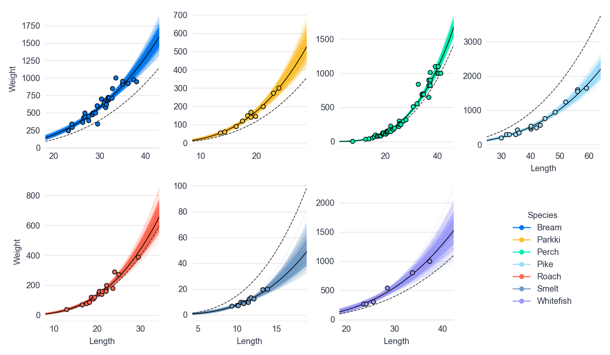

---
jupyter:
  jupytext:
    formats: ipynb,md
    text_representation:
      extension: .md
      format_name: markdown
      format_version: '1.3'
      jupytext_version: 1.13.8
  kernelspec:
    display_name: Python 3 (ipykernel)
    language: python
    name: python3
---

<!-- #region slideshow={"slide_type": "slide"} hide_input=true -->
# Bayesian Regression Refresher
<!-- #endregion -->

```python hide_input=false slideshow={"slide_type": "skip"}
import arviz as az
import matplotlib as mpl
import matplotlib.pyplot as plt
import numpy as np
import pandas as pd
import pymc as pm
import seaborn as sns

from matplotlib.lines import Line2D
from matplotlib.patches import  FancyArrowPatch
```

```python slideshow={"slide_type": "skip"}
%matplotlib inline
plt.style.use("intuitivebayes.mplstyle")

mpl.rcParams["figure.dpi"] = 120
mpl.rcParams["figure.facecolor"] = "white"
mpl.rcParams["axes.spines.left"] = False
FIGSIZE = (12, 7)
```

<!-- #region slideshow={"slide_type": "slide"} -->
## The setting

<center>
  
</center>
<!-- #endregion -->

<!-- #region slideshow={"slide_type": "notes"} -->
In this lesson, we'll imagine we are working in the data science team of an e-commerce company. In particular, we sell really good and fresh fish to our clients (mainly fancy restaurants).

<!-- #endregion -->

<!-- #region slideshow={"slide_type": "slide"} -->
## The problem

* We can't weigh each fish individually
* The weight of the fish is critical information for the business we operate in
* Is there a way to estimate the weigh of a fish from a picture?
  * We have historical data on fish dimensions and weight
<!-- #endregion -->

<!-- #region slideshow={"slide_type": "notes"} -->

When we ship our products, there is a very important piece of information we need: **the weight of the fish**. Why? First, because we bill our clients according to weight. Second, because the company that delivers the fish to our clients has different price tiers for weights, and those tiers can get really expensive. So we want to know the probability of an item being above that line. In other words, estimating uncertainty is important here!
<!-- #endregion -->

<!-- #region slideshow={"slide_type": "slide"} -->
## Spoilers, Yes there is

<center>
  
</center>
<!-- #endregion -->

<!-- #region slideshow={"slide_type": "notes"} -->
Surprise! We thought it would be nice to reveal just a little bit of the model we'll have built by the end of this lesson. 

This chart, which was made with lots of love, shows the relationship between fish length and weight, for each species. On top of that, there are the estimated regression curves, properly accounting for uncertainty using the whole posterior.

But if you're too surprised about what we are seeing because it looks so confusing, it may indicate that you could take the Introductory Course before moving forward with Advanced Regression. This lesson is meant to be a review and complement to what was already covered there and most of the content should look familiar already.
<!-- #endregion -->

<!-- #region slideshow={"slide_type": "slide"} -->
## We'll cover more than linear regression

1. Build a model step-by-step based on evidence
<!-- #endregion -->

<!-- #region slideshow={"slide_type": "fragment"} -->
2. Fit the model using the Bayesian approach
<!-- #endregion -->

<!-- #region slideshow={"slide_type": "fragment"} -->
3. Predict while accounting for uncertainty
<!-- #endregion -->

<!-- #region slideshow={"slide_type": "fragment"} -->
4. Communicate in the language the business cares about
<!-- #endregion -->

<!-- #region slideshow={"slide_type": "slide"} -->
## Exploratory Data Analysis
* Why its critical to look at your data no matter what kind of model you're building
<!-- #endregion -->

<!-- #region slideshow={"slide_type": "slide"} -->
## The worlds simplest model
* Plotting the straightest line
* The thing that most average people forget about linear regression
<!-- #endregion -->

<!-- #region slideshow={"slide_type": "slide"} -->
## Adding a covariate
* Insert bullet points
<!-- #endregion -->

<!-- #region slideshow={"slide_type": "slide"} -->
## Next section title
@tomas add section title 
<!-- #endregion -->

<!-- #region slideshow={"slide_type": "skip"} -->
### Section recap

* We are an e-commerce company that needs to know the weights of fish, without being able to directly weigh each fish immediately
* We will use size measurements together with a Bayesian Linear model to estimate weight
* Bayesian linear regression helps us:
    * Estimate a plausible range of costs
    * Determine all possible impacts on the bottom line, not just the most likely one
    * Communicate our results in the language business cares about
<!-- #endregion -->

<!-- #region slideshow={"slide_type": "notes"} -->
In this lesson you're not only learning linear regression, you're learning about how to estimate linear regression, and most importantly the thought process of creating a generative model and the workflow to do so. This one idea alone will put you far ahead of the "predict and pray" data scientists that mainly overfit models.

The beauty of the Bayesian framework is that you can incorporate the model estimates directly into the decision making process, considering all plausible scenarios and not only the most likely one.

Cherry on the cake, it also allows you - the modeler - to communicate your results in the only language business cares about -- money, money, money, as Abba would say.
<!-- #endregion -->

<!-- #region slideshow={"slide_type": "notes"} -->
None of this should feel new.

 This lesson is meant to be a review and complement to what was already covered there and most of the content should look familiar already. If you're too surprised about what we are seeing because it looks so confusing, it may indicate that you could take the Introductory Course before moving forward with Advanced Regression. We'll provide some resources if you prefer self learning
<!-- #endregion -->

<!-- #region slideshow={"slide_type": "notes"} -->
## Exploratory Data Analysis
* Why we should look at the data before modeling
* why blindly modelin
<!-- #endregion -->

<!-- #region slideshow={"slide_type": "slide"} -->
# Exploratory Data Analysis
Building a map for what were going to model
<!-- #endregion -->

<!-- #region slideshow={"slide_type": "slide"} -->
## Our challenge is just starting


<center>
  
</center>
<!-- #endregion -->

<!-- #region slideshow={"slide_type": "notes"} -->
We start a challenging adventure. We want to fit a linear regression model to predict the weight of fish. We know this is going to be extremely valuable to our company and we can't wait to get this rolling.
<!-- #endregion -->

<!-- #region slideshow={"slide_type": "slide"} -->
## Is linear regression the right choice?
** insert image **
<!-- #endregion -->

<!-- #region slideshow={"slide_type": "notes"} -->
But, how do we know we can fit a linear model to a dataset? Well, some may say won't ask that question and will blindly fit models to data.

And while that's a valid approach that may end up working sometimes, we know we can do something smarter.

<!-- #endregion -->

<!-- #region slideshow={"slide_type": "slide"} -->
## You need to look at the data

<center>
  
</center>
<!-- #endregion -->

<!-- #region slideshow={"slide_type": "notes"} -->
A better approach is to first get started by doing Exploratory Data Analysis (EDA). This will give us lots of valuable information about our dataset _before_ doing any modeling. 

Some of you may roll your eyes and say "I came here to learn Bayesian Stats!". We know it may sound boring. Believe us, EDA will help you be a better statistician. By the end of the course, you won't only know how to do Bayesian modeling, you'll also know what's the right tool for a given situation and why it works the way it does.
<!-- #endregion -->

<!-- #region slideshow={"slide_type": "slide"} -->
## Loading our fish data
<!-- #endregion -->

```python
data = pd.read_csv("data/fish-market.csv")
data
```

<!-- #region slideshow={"slide_type": "notes"} -->
Let's get started by exploring the data our team shared with us. There's the CSV file we need to load. As usual, we let the very handy `read_csv()` function do the work for us.

Great! We now have the data loaded. We see we have 159 observations and 7 variables. Each observation represents a single fish, so there are 159 different fish in total. We can try to figure out the meaning of the columns by their names, but it's better to check out the description provided with the data.
<!-- #endregion -->

<!-- #region slideshow={"slide_type": "skip"} -->
## Column Overview

<center>

| **Name** | **Description**                     |
|:--------:|-------------------------------------|
|  Species | Species name of fish                |
|  Weight  | Weight of fish in grams (g)         |
|  Length1 | Vertical length in centimeters (cm) |
|  Length2 | Diagonal length in centimeters (cm) |
| Length3  | Cross length in centimeters (cm)    |
| Height   | Height in centimeters (cm)          |
| Width    | Diagonal width in centimeters (cm)  |

</center>
<!-- #endregion -->

<!-- #region slideshow={"slide_type": "slide"} -->
## Deeper dive
<!-- #endregion -->

```python slideshow={"slide_type": "-"}
data.info()
```

<!-- #region slideshow={"slide_type": "notes"} -->
For each fish we have the its species, weight, height, width, and not one, not two, but three (!) different length measurements. 

Let's now check the column types and whether there are any missing values.

So far so good! Pandas let us know that all the columns have the appropriate data type and none of them have missing values.
<!-- #endregion -->

<!-- #region slideshow={"slide_type": "slide"} -->
## Summary statistics
<!-- #endregion -->

```python slideshow={"slide_type": "fragment"}
data.describe().round(2)
```

<!-- #region slideshow={"slide_type": "notes"} -->
The next step is to compute some basic summaries. We can get started with the numeric variables in the dataset. These simple aggregations are very powerful and give us quick and valuable information. For example:

* Fish weight ranges from 0, goes up to 1650 grams, and averages 400 grams. We can conclude we're working with small to medium sized fish.
* Weight variability is quite high. Its standard deviation is quite close to the mean. In other words, fish are quite different in terms of weight.

Shoot! Have a look at the summary table again. Can you spot any unexpected result? 

The minimum weight is zero (!). Have you ever seen anything on earth that weighs exactly zero? I haven't been that lucky, so it must be an error. Maybe the fish was too small for the scale to notice it, or there was a mistake somehow during data collection. 

For the lesson purposes is safe to ignore that record so we simply discard it.
<!-- #endregion -->

```python slideshow={"slide_type": "fragment"}
data = data[data["Weight"] > 0].reset_index(drop=True)
print(data["Weight"].min())
```

<!-- #region slideshow={"slide_type": "notes"} -->
It turns out that the smallest fish weights only 5.9 grams.

It feels a bit weird to have three columns for the length of the fish. These probably encode the same information so there's no point in keeping all of them. Let's explore the correlation among them to see if we can confirm our intuition.
<!-- #endregion -->

<!-- #region slideshow={"slide_type": "slide"} -->
## Linear Correlation 
<!-- #endregion -->

```python slideshow={"slide_type": "-"}
corr = data[["Length1", "Length2", "Length3"]].corr()
corr.style.background_gradient(cmap="coolwarm")
```

<!-- #region slideshow={"slide_type": "notes"} -->
Bingo! The three length measurements are extremely correlated. So, without more information about their differences, we should just arbitrarily drop two of them as they provide virtually the same information. 
<!-- #endregion -->

<!-- #region slideshow={"slide_type": "slide"} -->
## Dropping the extra columns
<!-- #endregion -->

```python slideshow={"slide_type": "-"}
data = data.drop(["Length2", "Length3"], axis="columns")
data.head()
```

<!-- #region slideshow={"slide_type": "notes"} -->
We drop the extra columns to make this tidy and remove the correlated columns
<!-- #endregion -->

<!-- #region slideshow={"slide_type": "slide"} hide_input=true -->
## How frequent species are?
<!-- #endregion -->

```python hide_input=true slideshow={"slide_type": "-"}
species_n = data["Species"].value_counts()
species_pct = (100 * species_n / species_n.sum()).round(2)

fig, ax = plt.subplots(figsize=FIGSIZE)
color = [f"C{i}" for i in range(len(species_n))]
ax.bar(species_n.index, species_n, color=color)
for i, n in enumerate(species_n):
    ax.text(i, n + 0.5, str(n), size=16, ha="center", va="bottom")
ax.set(xlabel="Species", ylabel="Number of fish", title="Number of fish by species");
```

<!-- #region slideshow={"slide_type": "notes"} -->
We have gained lots of insights so far and that's aswesome. But we're still missing key part: the species. It's time to show off our data visualization skills!

We can get started by exploring the number of records we have for each species using a nice chart.

The first thing we notice is the height of the bars are quite different. This means the number of records per species varies a lot. The most common species is (by far) Perch and it shows 56 records. Other species appear less frequently. Perkki and Whitefish are the most extreme cases with 11 and 6 records only.
<!-- #endregion -->

<!-- #region slideshow={"slide_type": "slide"} -->
## Table Summary
<!-- #endregion -->

```python hide_input=false slideshow={"slide_type": "-"}
pd.concat(
    [species_n, species_pct, species_pct.cumsum()], 
    axis=1, 
    keys=["Count", "Percentage (%)", "Cumulative Percentage (%)"]
).rename_axis("Species").reset_index()
```

<!-- #region slideshow={"slide_type": "fragment"} -->
* Perch and Bream represent around 60% of all the fish
* Whitefish appears very rarely
    * Perch is 10 times as frequent as Whitefish!
<!-- #endregion -->

<!-- #region slideshow={"slide_type": "notes"} -->
In this table view, we see the top-two species together make up around 60% of the fish in the data. That's quite a lot! To have an idea of how are the differences between species, we can compare Perch with Whitefish and see Perch is 10 times more common than Whitefish. That's a huge difference!
<!-- #endregion -->

<!-- #region slideshow={"slide_type": "slide"} -->
## How much do fish weigh?
<!-- #endregion -->

```python hide_input=true slideshow={"slide_type": "-"}
fig, ax = plt.subplots(figsize=FIGSIZE)
ax.hist(data["Weight"], ec="C0", alpha=0.85, bins=30)
ax.set(xlabel="Weight (grams)", ylabel="Count", title="Distribution of fish weight");
```

<!-- #region slideshow={"slide_type": "notes"} -->
We already got some insights about the weight. For example, we know the average fish weighs 400 grams. But that doesn't mean that 400 grams is a good number to represent all the fish! 

Also, we're Bayesians and we love distributions. So why don't just see the entire the distribution of all the weights?

Here we see taller bins for lower weights and shorter ones for higher weights. In other words, smaller weights are more common. 

As you may recall from the Introductory Course, when a distribution has this shape it is said it is a right-skewed distribution (because it has a long tail on the right side). So the distribution of weights is right-skewed.
<!-- #endregion -->

<!-- #region slideshow={"slide_type": "slide"} -->
## Plotting percentiles
<!-- #endregion -->

```python hide_input=true slideshow={"slide_type": "-"}
percentage = 0.8
quantile = data["Weight"].quantile(percentage)
text_y = 28
text_x_pad = 10

fig, ax = plt.subplots(figsize=FIGSIZE)
ax.hist(data["Weight"], ec="C0", alpha=0.85, bins=30)
ax.text(
    quantile + text_x_pad, 
    text_y, 
    f"{round(quantile)}gm ({round(percentage * 100)}% percentile)",
    size=14,
    va="top", 
    ha="left"
)
ax.vlines(quantile, 0, text_y, color="C1")
ax.set(xlabel="Weight (grams)", ylabel="Count", title="Distribution of fish weight");
```

<!-- #region slideshow={"slide_type": "notes"} -->
And that's not all! We can also add extra layers of information. For example, we can visualize percentiles on top of the distribution to get richer insights.
 
We overlay the 80% percentile and it confirms with numbers what we've been seeing so far: the dataset contains mostly small fish. 8 out of 10 fish in the data weigh 700 grams or less!
<!-- #endregion -->

<!-- #region slideshow={"slide_type": "slide"} -->
## How does weight vary from species to species?
<!-- #endregion -->

```python hide_input=true slideshow={"slide_type": "-"}
plot_data = data.groupby("Species")["Weight"].describe()
species_list = data["Species"].unique()

fig, ax = plt.subplots(figsize=FIGSIZE)

for i, species in enumerate(species_list):
    row = plot_data.loc[species]
    ax.scatter(row["50%"], i, s=100)
    ax.hlines(i, xmin=row["25%"], xmax=row["75%"], lw=5.2, color=f"C{i}")
    ax.hlines(i, xmin=row["min"], xmax=row["max"], lw=3.2, color=f"C{i}")
    ax.text(1750, i, f"n={round(row['count'])}", ha="left")

ax.set_yticks(np.arange(i + 1), species_list)
ax.set(xlabel="Weight (grams)", ylabel="Species", title="Fish weight by species");
```

<!-- #region slideshow={"slide_type": "notes"} -->
There's a related question we need to ask: Is the weight of the fish related to the species? In a more intuitive way, does knowing the species help us make a better guess of the fish weight? 

Our intuition and experience suggest so. But, we have data, right? So let's use it!

**Note:** Highlight as we describe each of the components

* How to read the chart
    * The dot represents the median weight
    * The thicker line represents 25% and 75% percentiles
    * The thinner line represents the minimum and the maximum values

As we expected, weight varies from species to species. Some species are similar (see Whitefish and Bream) and some others are waaay different (see Pike and Smelt). The spread of these distributions are different as well. For example, Parkki fish have very similar weights, while Bream varies a lot more.

The **main takeaway** is that the species is something we need to really consider when building our regression model. We expect to adjust weight predictions based on the species. If a model predicts the same weight for all fish no matter the species, well, that's a red flag! It's inconsistent with what we've just found.

So great to have this figured out! Thanks very much EDA!
<!-- #endregion -->

<!-- #region slideshow={"slide_type": "slide"} -->
## Relationship among fish measurements
<!-- #endregion -->

<!-- #region slideshow={"slide_type": "notes"} -->
We've been doing an intensive exploration so far. It's been exciting and insightful! Now we are in a much better position to start building our model. We know much more about the weight of the fish and how it varies from species to species. That's awesome!

On top of that, we have information about several other charactersitics of the fish like the length, height, and width. If we had to guess we would say longer, taller, and wider fish weigh more, right? That's pretty reasonable form a biological (and why not, culinary) perspective.

But we have data, folks! Let's use it!
<!-- #endregion -->

```python hide_input=false slideshow={"slide_type": "fragment"}
sns.pairplot(data, vars=["Length1", "Height", "Width", "Weight"], diag_kws={"bins": 30});
```

<!-- #region slideshow={"slide_type": "notes"} -->
The chart confirm our guess was right. All the variables are positively associated. Larger values of one variable are associated with larger values of the other. For example, longer fish are usually taller, wider, and heavier.

There's a another very interesting finding here. Some relationships are linear, while others are not. For example, Height and Width show a linear pattern, but Height and Weight don't.

What's even more curious is there seems to be clouds of points that are very well separated from each other. What can this be? Let's double-click on it!

**Note:** Highlight individual scatterplots when saying "Height and Width" and "Height and Weight". Even better, draw a straight and a curved line on each.
<!-- #endregion -->

<!-- #region slideshow={"slide_type": "slide"} -->
### Relationship among fish measurements
<!-- #endregion -->

```python slideshow={"slide_type": "fragment"}
sns.pairplot(data, vars=["Length1", "Height", "Width", "Weight"], hue="Species");
```

<!-- #region slideshow={"slide_type": "notes"} -->
Bingo! Once we map the species to the color of the dots we see clusters with dots of the same color. How can we read it? Length, height, and width are quite informative about the weight of the fish. But, on top of that, knowing the species adds even more information!

This is so exciting! We started from nothing and after all this work we have so much information about our data! I cannot wait until we start using all of this in our model!
<!-- #endregion -->

<!-- #region slideshow={"slide_type": "slide"} -->
## Section Recap
* Exploratory Data Analysis is recommended essential
    * Proper EDA  is what separates mediocre data practitioners and data scientist from great ones
    * Becomes more necessary when we get to advanced models
* In our fish data we noticed
    * Longer fish weigh more
    * Noted a non-linear patterns.
    * Species is an important feature we'll need to consider 
<!-- #endregion -->

<!-- #region slideshow={"slide_type": "slide"} -->
# Making a plan for models
Higher probability of a good modeling results when we use informed priors 
<!-- #endregion -->

<!-- #region slideshow={"slide_type": "slide"} -->
## Planning takes thought

<!-- #endregion -->

<center>
  
</center>

<!-- #region slideshow={"slide_type": "notes"} -->
In this case our EDA informed our priors about how make a Bayesian model.

We already extracted lots of information about the fish. This puts us in a much better position to start modeling. We're quite well informed to judge if model inferences make sense or not. That's the power of Exploratory Data Analysis!

We have one last job to do: we're making a plan! We want to trace a path that we're going to follow when developing our Bayesian Regression model.
<!-- #endregion -->

<!-- #region slideshow={"slide_type": "slide"} -->
## Model 1: Our simplest baseline

No predictors. Just weight information
<!-- #endregion -->

```python hide_input=true slideshow={"slide_type": "fragment"}
fig, ax = plt.subplots(figsize=FIGSIZE)
ax.hist(data["Weight"], ec="C0", alpha=0.85, bins=30)
ax.set(xlabel="Weight (grams)", ylabel="Count", title="Distribution of fish weight");
```

<!-- #region slideshow={"slide_type": "notes"} -->
First of all, we are going to create a **baseline model**. This model won't incorporate any information but the fish weight. Yes, it sounds quite crazy! But that's what we're going to do to get started. The only feature of the fish the model is going to see is their weight. Just like what we can see in the following histogram.
<!-- #endregion -->

<!-- #region slideshow={"slide_type": "slide"} -->
## Model 2: Adding a continuous predictor

Use fish length to predict weight
<!-- #endregion -->

```python hide_input=true slideshow={"slide_type": "fragment"}
fig, ax = plt.subplots(figsize=FIGSIZE)
ax.scatter(x=data["Length1"], y=data["Weight"], alpha=0.6)
ax.set(xlabel="Length (centimeters)", ylabel="Weight (grams)", title="Fish length vs weight");
```

<!-- #region slideshow={"slide_type": "notes"} -->
Don't we know much more about the fish?!

Of course, yes! That's our next step: adding predictors. We'll first add the fish length. We can anticipate this will give us a much richer model, which now can see how long fish are and use it to predict weight. Following our graphical story, this is equivalent to having access to the following scatterplot. Here we can see the length of the fish gives us valuable information about the weight.
<!-- #endregion -->

<!-- #region slideshow={"slide_type": "slide"} -->
## Model 3: Adding a categorical predictor
Adding a species predictor
<!-- #endregion -->

```python hide_input=true slideshow={"slide_type": "fragment"}
species, species_idx = np.unique(data["Species"], return_inverse=True)
color = [f"C{i}" for i in species_idx]
handles = [
    Line2D([], [], label=s, lw=0, marker="o", ms=8, color=f"C{i}", alpha=0.6)
    for i, s in enumerate(species)
]

fig, ax = plt.subplots(figsize=FIGSIZE)
fig.subplots_adjust(right=0.8)
ax.scatter(
    x=data["Length1"], 
    y=data["Weight"], 
    color=color,
    alpha=0.6
)
ax.set(xlabel="Length", ylabel="Weight", title="Fish length vs weight")
ax.legend(
    handles=handles, 
    title="Species", 
    loc="center left", 
    bbox_to_anchor=(0.8, 0.5),
    bbox_transform=fig.transFigure 
);
```

<!-- #region slideshow={"slide_type": "notes"} -->
And if you're wondering about the species we mentioned so many times, that's what's coming next! We'll be adding the species as a predictor in our model. As we can see in the following chart, we expect it to add even more information on top of what the fish length already gives. 

Finally, we'll see how we can incorporate the other fish measurements into the model. Our exploration suggests that not only the length is informative of the fish weight. We also have width and height, right? We'll cover how to add them very close to the end of the lesson.
<!-- #endregion -->

<!-- #region slideshow={"slide_type": "slide"} -->
## This is just the Bayesian Workflow
<!-- #endregion -->

<center>
  
</center>

<!-- #region slideshow={"slide_type": "notes"} -->
We're following a simplified version of the Bayesian workflow, which is a structured series of steps to achieve consciouisly achieve a great modeling result. From experience we can tell you this works better than a "random search" You'll see this many times in throughout the course,
<!-- #endregion -->

<!-- #region slideshow={"slide_type": "slide"} -->
## Section Recap

* We recommend following Bayesian Workflow
  * Doing so helps you be more efficient but also saves you time if you run into issues
  * Enables justification of complexity as we go
* For our fish model we anticipate building three models
  * No covariate regression e.g. No predictors
  * Single covariate
  * Single covariate with categorical (@tomas to come up with something)
<!-- #endregion -->

<!-- #region slideshow={"slide_type": "notes"} -->
It's been a very intense exploration. But it's been worth it! After this much work, we were able to provide ourselves with so many resources that make us feel much more confident about the modeling work that comes next.
<!-- #endregion -->

<!-- #region slideshow={"slide_type": "slide"} -->
# The world's simplest model
Also known as average regression
<!-- #endregion -->

<!-- #region slideshow={"slide_type": "notes"} -->
The moment we've been waiting for has come. Finally, it's time to start modeling! 

But as with many things in life, we need to walk before we can run. This is to make sure we don't stumble once things get more complex and fun. 

So now we start very simple. So simple we decided to name this model as "The world's simplest model".

In this section we'll cover the following points:
<!-- #endregion -->

<!-- #region slideshow={"slide_type": "fragment"} -->
* The intuition behind this model
* How the intuition translates to math
* The implementation in PyMC
* Analysis of the results
<!-- #endregion -->

<!-- #region slideshow={"slide_type": "slide"} -->
## The simplest idea ever
<!-- #endregion -->

All fish weigh the same

<!-- #region slideshow={"slide_type": "fragment"} -->
### The idea in math
<!-- #endregion -->

$$
\text{Weight}_i = \text{Constant value}
$$

<!-- #region slideshow={"slide_type": "notes"} -->
Nobody has gone crazy here. The model we're going to build in this section is that simple. It sees the fish as if they all weigh the same. 

In math, the simplest idea is translated into $\text{Weight}_i = \text{Constant value}$. This is simply the mathematical way to say that all fish, indexed by $i$, weight the same (thus the "Constant value").
<!-- #endregion -->

<!-- #region slideshow={"slide_type": "slide"} -->
## Expanded math notation
<!-- #endregion -->

<!-- #region slideshow={"slide_type": "fragment"} -->
$$
\begin{aligned}
\text{Weight}_i &= \beta_0 + \varepsilon_i \\
\varepsilon_i & \sim \text{Normal}(0, \sigma) 
\end{aligned}
$$
<!-- #endregion -->

<!-- #region slideshow={"slide_type": "fragment"} -->
with the following priors

$$
\begin{aligned}
\beta_0 & \sim \text{Normal}(0, \sigma_{\beta_0}) \\
\sigma & \sim \text{HalfNormal}(\sigma_\varepsilon)
\end{aligned}
$$
<!-- #endregion -->

<!-- #region slideshow={"slide_type": "notes"} -->
We can go further and translate the formulation above into a more statistical model notation.


It's lots of information! Let's digest it one by one, step by step. See the first line

$$\text{Weight}_i = \beta_0 + \varepsilon_i$$

In statistics we usually use the greek letter $\beta_0$ to denote what represents a constant value in linear models. It maps straightforwardly to the $\text{Constant value}$ we've written above. 

Next, $\varepsilon_i$ is the error term. It's there to account for the fact that the model is not a perfect representation of the real world phenomena, but a simplification that implies a certain degree of error. This error is a random variable, and as such, is modeled using a probability distribution. Which distribution we decide to use is critical and determines the properties of the model.

$\varepsilon_i \sim \text{Normal}(0, \sigma)$ represents probability distribution used to model the error. It says the error follows a Normal distribution and that's why this type of model is known as **Normal linear regression** (we'll come to why it's linear later ;)). We assume the error mean is zero and has a standard deviation of $\sigma$.

Then it comes one of the parts that distinguishes us as Bayesian data scientists: priors! We need to pick a prior for the parameters in the model $\beta_0$ and $\sigma$. We take a classic approach and use a Normal prior centered around 0 for $\beta_0$ and a HalfNormal prior for $\sigma$. Remember, HalfNormal is like the Normal distribution but for positive values only, as needed for a standard deviation.

Finally, $\sigma_{\beta_0}$ and $\sigma_\varepsilon$. These are the parameters of the prior distributions. They control the spread of the priors for $\beta_0$ and $\sigma$, respectively. Later we'll set them a real value.
<!-- #endregion -->

<!-- #region slideshow={"slide_type": "slide"} -->
## A fully Bayesian approach
<!-- #endregion -->

<!-- #region slideshow={"slide_type": "fragment"} -->
### Condensed Math
$$
\begin{aligned}
\beta_0 & \sim \text{Normal}(0, \sigma_{\beta_0}) \\
\sigma & \sim \text{HalfNormal}(\sigma_\varepsilon) \\
\text{Weight}_i & \sim \text{Normal}(\beta_0, \sigma) 
\end{aligned}
$$
<!-- #endregion -->

<!-- #region slideshow={"slide_type": "fragment"} -->
### The PyMC Code
<!-- #endregion -->

```python slideshow={"slide_type": "-"}
with pm.Model() as model:
    β0 = pm.Normal("β0", mu=0, sigma=200)
    sigma = pm.HalfNormal("σ", sigma=20)
    pm.Normal("weight", mu=β0, sigma=sigma, observed=data["Weight"])
```

<!-- #region slideshow={"slide_type": "notes"} -->
The condensed and distributional representation is very common in Bayesian statistics. It summarises both the information of the priors and the likelihood. It makes it very clear that this model uses a Normal likelihood function since Normal is the distribution chosen for the Weight.

Then, we use PyMC to build our model. One of the features that distinguish PyMC is its expressiveness. It allows us to map the statistical formulation of the model into very clear and concise Python code. It's so neat!
<!-- #endregion -->

<!-- #region slideshow={"slide_type": "slide"} -->
## Let's get the MCMC sampler sampling
<!-- #endregion -->

```python slideshow={"slide_type": "fragment"}
with model:
    idata = pm.sample(chains=4, random_seed=1234)
```

<!-- #region slideshow={"slide_type": "notes"} -->
Modern Bayesian inference is really fast. With Markov Chain Monte Carlo, also called MCMC, we get samples that approximate the posterior. We won't be discussing details of the sampler in this course, we assume you already know it, though we'll link some resources if you curious.

The takeaway is most of the time, especially with linear models, if things are specified correctly sampling and hte data is quick and easy. 

It's also great to see there are no warning messages for us.
<!-- #endregion -->
<!-- #region slideshow={"slide_type": "slide"} -->
## Analyze the posterior: MCMC checks
<!-- #endregion -->

```python slideshow={"slide_type": "-"}
az.plot_trace(idata, compact=False, backend_kwargs={"tight_layout": True});
```

<!-- #region slideshow={"slide_type": "notes"} -->
With MCMC its always a good idea to check your posterior. Let's produce a traceplot to evaluate chain quality.
This plot is called a traceplot, what we  look for on the right is the "fuzzy caterpillar"

* Sampling went so good!
* No evident MCMC convergence issues
* All chains converged to the same distribution

Both posteriors have a bell shape, and the estimates from all chains are quite similar. The traces are all also very similar and they look very much like white noise, meaning there's no convergence or mixing issues. That's great!
<!-- #endregion -->

<!-- #region slideshow={"slide_type": "slide"} -->
## Analyze the posterior: High Level Summary
<!-- #endregion -->

```python slideshow={"slide_type": "fragment"}
az.summary(idata, round_to=2, kind="stats")
```

<!-- #region slideshow={"slide_type": "skip"} -->
`az.summary()` is the way to go if we want to obtain a quick summary of the posterior. The argument `kind="stats"` indicates we only want statistical summaries from the posterior and not sampling diagnostics.
<!-- #endregion -->

<!-- #region slideshow={"slide_type": "notes"} -->
Let's interpret the results!

First of all, the uncertainty around $\beta_0$ and $\sigma$ is low if we compare their respective standard deviations with their respective means. That's the good part!

But if we also compare $\sigma$ with the usual weights, we can conclude $\sigma$ is quite high. This will be translated into high uncertainty in the prediction of weight for new fish. 
<!-- #endregion -->

<!-- #region slideshow={"slide_type": "slide"} -->
## The empirical Mean

<!-- #endregion -->

Just a single point

```python slideshow={"slide_type": "fragment"}
empirical_mean = round(data["Weight"].mean(), 2)
empirical_mean
```

```python hide_input=true
fig, ax = plt.subplots(figsize=FIGSIZE)
ax.set_xlim(315, 485)
ax.axvline(empirical_mean, c="C1", label="Empirical Mean")
ax.legend();
```

<!-- #region slideshow={"slide_type": "notes"} -->
If we ignore our Bayesian analysis for a second and just look at the mean this is what we get. Just a single point estimate for all the fish. No measure of uncertainty.
<!-- #endregion -->

<!-- #region slideshow={"slide_type": "slide"} -->
## The Bayesian Mean
<!-- #endregion -->

A whole probability distribution

```python hide_input=true
fig, ax = plt.subplots(figsize=FIGSIZE)
az.plot_posterior(idata, var_names="β0", ax=ax)
ax.axvline(empirical_mean, c="C1", label="Empirical Mean")
ax.set_xlim(315, 485)
ax.legend();
```

<!-- #region slideshow={"slide_type": "notes"} -->
On the other hand, the Bayesian model provides a whole probability distribution for the mean weight, the posterior of $\beta_0$. This allows us to account for the uncertainty in a principled way.
<!-- #endregion -->

<!-- #region slideshow={"slide_type": "slide"} -->
## Mean Uncertainty vs Individual Observation Uncertainty
<!-- #endregion -->

```python
with model:
    pm.sample_posterior_predictive(idata, extend_inferencedata=True)
```

<!-- #region slideshow={"slide_type": "notes"} -->
Does the $\beta_0$ posterior mean the model is confident that all fish weigh between 357 and 433 grams? Nope! $\beta_0$ represents the mean of the weight. So that posterior is a distribution for the mean weight, not the individual weights. 

From a Bayesian model we get two results. The posterior estimate of the mean with $\beta_0$, but also the posterior estimate of individual fish, which is known as the **posterior predictive distribution**.

PyMC makes it very easier to obtain the posterior predictive distribution and incorporate it into the existing InferenceData object we got when we fitted the model.
<!-- #endregion -->

<!-- #region slideshow={"slide_type": "slide"} -->
## Mean Uncertainty vs Individual Observation Uncertainty
<!-- #endregion -->

```python slideshow={"slide_type": "-"} hide_input=true
fig, ax = plt.subplots(figsize=FIGSIZE)
ax.axvline(empirical_mean, label="Empirical Mean", color="C1")
az.plot_posterior(idata, var_names="β0", ax=ax, label="Mean weight posterior", color="C0")
az.plot_dist(idata.posterior_predictive["weight"], label="Individual weight posterior", color="C6")
ax.legend();
```

How does the posterior predictive distribution compares to the posterior of the mean weight? Let's have a look at this chart, which contains lots of information.

We have the the empirical mean and the posterior for the mean weight, which we have already seen. The new distribution is the one we use to predict the weight of an individual fish (i.e. the posterior predictive distribution).

The posterior predictive distribution is also centered around the mean of $\beta_0$, but its uncertainty is larger to account for the fact we're predicting at the individual level.

Wait, holy crap! This is so uncertain it even allows negative values. 

As humans we know negative values are impossible. If we could build a model that by design restricts the output to positive values only, that would be great. You know what? It's possible indeed! But we won't do that now. You'll see that happen in later lessons.

This is not the end of the world either. We're just getting started and this is just evidence suggesting better modeling efforts are needed.

<!-- #region slideshow={"slide_type": "slide"} -->
## Visualize the fitted curve
<!-- #endregion -->

```python hide_input=true slideshow={"slide_type": "fragment"}
fig, ax = plt.subplots(figsize=FIGSIZE)
ax.scatter(x=data["Length1"], y=data["Weight"], alpha=0.6)
ax.set(xlabel="Length (centimeters)", ylabel="Weight (grams)", title="Fish length vs weight");
```

<!-- #region slideshow={"slide_type": "notes"} -->
Before we finish this section, it's good to go a step further and visualize the model on top of the scatterplot of Length vs Weight. This is going to give us a better idea of how the fitted curve looks like.
<!-- #endregion -->

<!-- #region hide_input=true slideshow={"slide_type": "slide"} -->
## Visualize the fitted curve
<!-- #endregion -->

```python hide_input=true slideshow={"slide_type": "fragment"}
fig, ax = plt.subplots(figsize=FIGSIZE)
ax.scatter(x=data["Length1"], y=data["Weight"], alpha=0.6)
ax.set(xlabel="Length (centimeters)", ylabel="Weight (grams)", title="Fish length vs weight");

for value in idata.posterior["β0"].to_numpy().flatten()[::10]:
    ax.axhline(value, color="C1", alpha=0.2)

β0_mean = idata.posterior["β0"].to_numpy().mean()
ax.axhline(β0_mean, color="C4")

handles = [
    Line2D([], [], label="Observations", lw=0, marker="o", color="C0", alpha=0.6),
    Line2D([], [], label="Posterior draws", lw=2, color="C1"),
    Line2D([], [], label="Posterior mean", lw=2, color="C4"),
]
ax.legend(handles=handles, loc="upper left");
```

<!-- #region slideshow={"slide_type": "skip"} -->
Surprise! The world's simplest model is a flat line. It predicts the same weight for all fish no matter their length, or any other aspect.

As we've seen previously, this line is equal to the sample mean plus some smoothing due to the priors.

One of the good aspects of going Bayesian is that we get uncertainty quantification and visualization for free. This is very important!
<!-- #endregion -->

<!-- #region slideshow={"slide_type": "slide"} -->
### Section Recap

* Straight lines are powerful building blocks for statistical modeling
* The simplest linear regression model we can build is a flat line.
    * It omits all the information from any available predictor
    * It assigns the same weight for all the fish
    * It is known as the intercept only model
* Parameters in the linear function have an interpretable meaning
    * We discovered the learned intercept is equal to the mean response
* In Bayesian Regression we get uncertainty quantification for free
    * Even for as things as simple as the mean
<!-- #endregion -->

<!-- #region slideshow={"slide_type": "slide"} -->
# Adding a slope
<!-- #endregion -->

<!-- #region slideshow={"slide_type": "slide"} -->
## Adding a slope

<center>
  
</center>
<!-- #endregion -->

<!-- #region slideshow={"slide_type": "notes"} -->

<!-- #endregion -->

<!-- #region slideshow={"slide_type": "slide"} -->
## Adding a slope

* We're happy we created our first model
* The EDA shows other measurements give valuable information about the fish weight
* Add predictors to the model
<!-- #endregion -->

<!-- #region slideshow={"slide_type": "notes"} -->
Creating our first model in the previous section was a great milestone. Although simple, it was a great opportunity to get us rolling. Nonetheless, this new section has many other exciting and challenging stuff prepared for us.

From the Exploratory Data Analysis we carried out earlier, it's pretty obvious that other measurements of the fish contain valuable information about the weight. It would be great if we could make our model be aware of that. 

In this section, we will learn how to incorporate predictors into the model so it has more information and hopefully makes better choices when predicting fish weight. 
<!-- #endregion -->

<!-- #region slideshow={"slide_type": "slide"} -->
### Intercept only model review
<!-- #endregion -->

```python hide_input=true slideshow={"slide_type": "-"}
fig, ax = plt.subplots(figsize=FIGSIZE)
ax.scatter(x=data["Length1"], y=data["Weight"], alpha=0.6)
ax.set(xlabel="Length (centimeters)", ylabel="Weight (grams)", title="Fish length vs weight")

for value in idata.posterior["β0"].to_numpy().flatten()[::10]:
    ax.axhline(value, color="C1", alpha=0.2)

β0_mean = idata.posterior["β0"].to_numpy().mean()
ax.axhline(β0_mean, color="C4")

handles = [
    Line2D([], [], label="Observations", lw=0, marker="o", color="C0", alpha=0.6),
    Line2D([], [], label="Posterior draws", lw=2, color="C1"),
    Line2D([], [], label="Posterior mean", lw=2, color="C4"),
]
ax.legend(handles=handles, loc="upper left");
```

<!-- #region slideshow={"slide_type": "notes"} -->
Let's have a second look at the intercept-only model we built in the previous section.

The pattern we observe tells us that shorter fish are usually lighter, and longer fish are usually heavier. The improved model should incorporate this information somehow so it's not a flat line anymore.
<!-- #endregion -->

<!-- #region slideshow={"slide_type": "slide"} -->
## Improve the intercept-only model
<!-- #endregion -->

<!-- #region slideshow={"slide_type": "-"} -->
$$
\text{Weight}_i = \beta_0
$$
<!-- #endregion -->

<!-- #region slideshow={"slide_type": "fragment"} -->
$$
\text{Weight}_i = \beta_0 + \beta_1 \text{Length}_i
$$
<!-- #endregion -->

<!-- #region slideshow={"slide_type": "notes"} -->
The previous model says that the weight is equal to a constant value that we call intercept. How do we make the weight change as length changes? The answer: Add a slope!


<!-- #endregion -->

<!-- #region slideshow={"slide_type": "slide"} -->
## Bayesian linear regression
<!-- #endregion -->

<!-- #region slideshow={"slide_type": "-"} -->
$$
\begin{aligned}
\beta_0 & \sim \text{Normal}(0, \sigma_{\beta_0}) \\
\beta_1 & \sim \text{Normal}(0, \sigma_{\beta_1}) \\
\sigma & \sim \text{HalfNormal}(\sigma_\varepsilon) \\
\mu_i & = \beta_0 + \beta_1 \text{Length}_i \\
\text{Weight}_i & \sim \text{Normal}(\mu_i, \sigma)
\end{aligned}
$$
<!-- #endregion -->

```python slideshow={"slide_type": "fragment"}
length = data["Length1"].to_numpy()
with pm.Model() as model:
    β0 = pm.Normal("β0", mu=0, sigma=200)
    β1 = pm.Normal("β1", mu=0, sigma=10)
    sigma = pm.HalfNormal("σ", sigma=20)
    mu = β0 + β1 * length
    pm.Normal("weight", mu=mu, sigma=sigma, observed=data["Weight"])
```

<!-- #region slideshow={"slide_type": "notes"} -->
Adding priors and writing everything down we come up with the following model and then the PyMC code comes again very naturally.
<!-- #endregion -->

<!-- #region slideshow={"slide_type": "slide"} -->
## It's time to fit again
<!-- #endregion -->

```python slideshow={"slide_type": "-"}
with model:
    idata = pm.sample(chains=4, target_accept=0.9, random_seed=1234)
```

```python slideshow={"slide_type": "fragment"}
az.summary(idata, round_to=2, kind="stats")
```

* We predict an increase of 32 grams per additional centimeter of length

<!-- #region slideshow={"slide_type": "slide"} -->
## Analyze the posterior: parameters
<!-- #endregion -->

```python slideshow={"slide_type": "-"}
fig, axes = plt.subplots(1, 3, figsize=(12, 4))
az.plot_posterior(idata, ax=axes);
```

<!-- #region slideshow={"slide_type": "slide"} -->
### Analyze the posterior: fitted curve
<!-- #endregion -->

<!-- #region hide_input=true slideshow={"slide_type": "notes"} -->
Let's see how the well the curve actually fits the data
<!-- #endregion -->

```python hide_input=true slideshow={"slide_type": "fragment"}
b0_draws = idata.posterior["β0"][:, ::10].to_numpy().flatten()
b1_draws = idata.posterior["β1"][:, ::10].to_numpy().flatten()

fig, ax = plt.subplots(figsize=FIGSIZE)
ax.scatter(data["Length1"], data["Weight"], alpha=0.6)
ax.set(xlabel="Length (centimeters)", ylabel="Weight (grams)", title="Fish length vs weight")

x_grid = np.array(ax.get_xlim())
for b0, b1 in zip(b0_draws, b1_draws):
    ax.plot(x_grid, b0 + b1 * x_grid, color="C1", alpha=0.1)

b0_mean = b0_draws.mean().item()
b1_mean = b1_draws.mean().item()
ax.plot(x_grid, b0_mean + b1_mean * x_grid, color="C4")

handles = [
    Line2D([], [], label="Observations", lw=0, marker="o", color="C0", alpha=0.6),
    Line2D([], [], label="Posterior draws", lw=2, color="C1"),
    Line2D([], [], label="Posterior mean", lw=2, color="C4"),
]
ax.legend(handles=handles, loc="upper left");
```

<!-- #region slideshow={"slide_type": "notes"} -->
Awesome, we got what we wanted. Now the model has a slope and it accounts for the fish length when predicting weight. The longer the fish, the larger the predicted weight. Also, the Bayesian approach gives credibility bands for free. I can't be more happy!

Oh, wait! Do you see that? Holy crap! The fit is actually terrible! And there's more! it predicts negative values!

**Note:** Highlight the horizontal line at y = 0 when saying "do you see that!?"

TODO: Add gif/meme person crying
<!-- #endregion -->

<!-- #region slideshow={"slide_type": "slide"} -->
## What did we do wrong?!
<!-- #endregion -->

<!-- #region slideshow={"slide_type": "fragment"} -->
* Linear regression is about fitting straight lines to data
<!-- #endregion -->

<!-- #region slideshow={"slide_type": "fragment"} -->
* We did it successfully.
    * We wanted a linear fit
    * We got a linear fit!
<!-- #endregion -->

<!-- #region slideshow={"slide_type": "fragment"} -->
* We missed a key point: The relationship between length and weight is non-linear!
<!-- #endregion -->

```python hide_input=true slideshow={"slide_type": "slide"}
fig, ax = plt.subplots(figsize=FIGSIZE)
ax.scatter(data["Length1"], data["Weight"], alpha=0.6)
ax.set(xlabel="Length (centimeters)", ylabel="Weight (grams)", title="Fish length vs weight");
```

<!-- #region slideshow={"slide_type": "slide"} -->
### Section Recap

* Simple linear regression is powerful.
    * We could incorporate predictors into our predictive model.
    * All of this with proper uncertainty quantification.
* Linear fit was terrible in this case
* EDA is important to ensure the linear approximation applies to the problem at hand.
    * We knew to expect that from our EDA
<!-- #endregion -->

<!-- #region slideshow={"slide_type": "slide"} -->
# Transformations
Every modeler's swiss army knife
<!-- #endregion -->

<!-- #region slideshow={"slide_type": "skip"} -->
Note: Not so convinced by the equivalence between transformation (a tool) and a swiss army knife (set of tools)
<!-- #endregion -->

<!-- #region slideshow={"slide_type": "slide"} -->
## Transformations
<!-- #endregion -->

<!-- #region slideshow={"slide_type": "-"} -->
* Linear regression doesn't seem to be the right fit for our problem
<!-- #endregion -->

<!-- #region slideshow={"slide_type": "fragment"} -->
* We just need to look at it from a different angle
<!-- #endregion -->

<!-- #region slideshow={"slide_type": "notes"} -->

We're facing a very serious problem. We want to use linear regression to predict fish weight and we've just seen the plain linear regression model we wrote works terribly. A straight line was a very bad choice to approximate the relationship between fish length and weight. 

Is there anything we can do? Does it mean we have to throw linear modeling away and pick up another strategy? That's it?! 

No way, we've just got started and linear models can still take us much further. We just need to incorporate a new trick into our modeling toolbox: **transformations**.
<!-- #endregion -->

<!-- #region slideshow={"slide_type": "slide"} -->
## What's the deal?
<!-- #endregion -->

<!-- #region slideshow={"slide_type": "-"} -->
* Transformations are just mathematical functions
    * Square root $f(x) = \sqrt x$
    * Logarithm $f(x) = \log(x)$
    * Exponential $f(x) = e^x$
<!-- #endregion -->

<!-- #region slideshow={"slide_type": "-"} -->
* They transform our variables into something else
<!-- #endregion -->

<!-- #region slideshow={"slide_type": "-"} -->
* We use $f(\text{Length})$ instead of $\text{Length}$
<!-- #endregion -->

<!-- #region slideshow={"slide_type": "notes"} -->
What do we mean with transformations? What are them? How do we use them?

Transformations are simply another name for functions, mathematical functions. Like square root function, logarithm function, exponential function, sine functions, or even polynomials. Whatever function you may think of, can be used as a transformation (disclaimer: that doesn't mean it's going to make sense!). We say "transformations" because they transform our variables into something else.

To use a transformation we just apply the function to variable(s) in the model and use its result instead of the original one(s). For example, instead of using `Length` to predict `Weight`, we can use a function of `Length` we can call `f(Length)`. The same way, we can transform the response `Weight` into `f(Weight)`.
<!-- #endregion -->

## The original setting

```python slideshow={"slide_type": "-"} hide_input=true
fig, ax = plt.subplots(figsize=FIGSIZE)
ax.scatter(data["Length1"], data["Weight"], alpha=0.6)
ax.set(xlabel="Length", ylabel="Weight", title="Fish length vs weight");
```

<!-- #region slideshow={"slide_type": "notes"} hide_input=true -->

<!-- #endregion -->

<!-- #region slideshow={"slide_type": "slide"} -->
## Transform X
<!-- #endregion -->

```python slideshow={"slide_type": "slide"} hide_input=true
fig, ax = plt.subplots(figsize=FIGSIZE)
ax.scatter(np.log(data["Length1"]), data["Weight"], alpha=0.6)
ax.set(xlabel="log(Length)", ylabel="Weight", title="log(Length) vs Weight");
```

<!-- #region slideshow={"slide_type": "notes"} -->
Let's transform `Length` into `log(Length)`. Hmm, still looks exponential. What can we do now?
<!-- #endregion -->

<!-- #region slideshow={"slide_type": "slide"} -->
## Transform Y
<!-- #endregion -->

```python slideshow={"slide_type": "slide"} hide_input=true
fig, ax = plt.subplots(figsize=FIGSIZE)
ax.scatter(data["Length1"], np.log(data["Weight"]), alpha=0.6)
ax.set(xlabel="Length", ylabel="log(Weight)", title="Length vs log(Weight)");
```

<!-- #region slideshow={"slide_type": "notes"} -->
Let's try transforming the response variable now. 

Crap! We got a completely different shape. Still not linear though... 
<!-- #endregion -->

<!-- #region slideshow={"slide_type": "slide"} -->
## Transform X and Y
<!-- #endregion -->

```python slideshow={"slide_type": "slide"} hide_input=true
fig, ax = plt.subplots(figsize=FIGSIZE)
ax.scatter(np.log(data["Length1"]), np.log(data["Weight"]), alpha=0.6)
ax.set(xlabel="log(Length)", ylabel="log(Weight)", title="log(Length) vs log(Weight)");
```

<!-- #region slideshow={"slide_type": "slide"} -->
What if we transform **both** variables at the same time?

This is awesome! Turns out `log(Length)` and `log(Weight)` are indeed linearly related. This is all we needed! Let's jump into the next step: build a linear regression model on the transformed space.

Is it always the case we need to transform both variables? The answer is no. Sometimes you transform one, sometimes the other, sometimes both. 
<!-- #endregion -->

**Note:** Do we show the following model in the same section, or do we make it a new one?

<!-- #region slideshow={"slide_type": "slide"} -->
## Regression on the transformed variables
<!-- #endregion -->

<!-- #region slideshow={"slide_type": "-"} -->
$$
\log{(\text{Weight}_i)} = \beta_0 + \beta_1 \log{(\text{Length}_i)} + \varepsilon_i
$$
<!-- #endregion -->

<!-- #region slideshow={"slide_type": "notes"} -->
Taking all the components together, the formula for the linear regression now model looks as follows.

It's exactly the same structure than before, we only changed the variables for the transformed ones. All the rest remains the same.
<!-- #endregion -->

<!-- #region slideshow={"slide_type": "slide"} -->
## The Bayesian way
<!-- #endregion -->

<!-- #region slideshow={"slide_type": "-"} -->
$$
\begin{aligned}
\beta_0 & \sim \text{Normal}(0, \sigma_{\beta_0}) \\
\beta_1 & \sim \text{Normal}(0, \sigma_{\beta_1}) \\
\sigma & \sim \text{HalfNormal}(\sigma_\varepsilon) \\
\mu_i & = \beta_0 + \beta_1 \log{(\text{Length}_i)} \\
\log{(\text{Weight}_i)} & \sim \text{Normal}(\mu_i, \sigma)
\end{aligned}
$$
<!-- #endregion -->

```python slideshow={"slide_type": "fragment"}
log_length = np.log(data["Length1"].to_numpy())
log_weight = np.log(data["Weight"].to_numpy())

with pm.Model() as model:
    β0 = pm.Normal("β0", mu=0, sigma=5)
    β1 = pm.Normal("β1", mu=0, sigma=5)
    sigma = pm.HalfNormal("σ", sigma=5)
    mu = β0 + β1 * log_length
    pm.Normal("weight", mu=mu, sigma=sigma, observed=log_weight)
```

<!-- #region slideshow={"slide_type": "notes"} -->
Notice again how close PyMC resembles the math...So clean!
<!-- #endregion -->

```python slideshow={"slide_type": "slide"}
with model:
    idata = pm.sample(chains=4, target_accept=0.85, random_seed=1234)
```

```python slideshow={"slide_type": "slide"}
az.summary(idata, round_to=2, kind="stats")
```

```python slideshow={"slide_type": "slide"}
az.plot_trace(idata, compact=False, backend_kwargs={"tight_layout": True});
```

```python slideshow={"slide_type": "slide"} hide_input=true
b0_draws = idata.posterior["β0"][:, ::10].to_numpy().flatten()
b1_draws = idata.posterior["β1"][:, ::10].to_numpy().flatten()

fig, ax = plt.subplots(figsize=(14, 7))
ax.scatter(np.log(data["Length1"]), np.log(data["Weight"]), alpha=0.6)
ax.set(xlabel="log(Length)", ylabel="log(Weight)")

x_grid = np.array(ax.get_xlim())
for b0, b1 in zip(b0_draws, b1_draws):
    ax.plot(x_grid, b0 + b1 * x_grid, color="C1", alpha=0.1)

b0_mean = b0_draws.mean().item()
b1_mean = b1_draws.mean().item()
ax.plot(x_grid, b0_mean + b1_mean * x_grid, color="C4")

handles = [
    Line2D([], [], label="Observations", lw=0, marker="o", color="C0", alpha=0.6),
    Line2D([], [], label="Posterior draws", lw=2, color="C1"),
    Line2D([], [], label="Posterior mean", lw=2, color="C4"),
]
ax.legend(handles=handles, loc="upper left");
```

<!-- #region slideshow={"slide_type": "slide"} -->
The fit is so much better now. After much hard work we finally got it! Yay! 

Wait... But this is in the log space! How are we going to tell our boss about this?! 

Transformations are even more awesome than what we can anticipate. We just used log transforms to fit the model. But you know what's an even cooler feature? We can transform back!
<!-- #endregion -->

```python slideshow={"slide_type": "slide"} hide_input=true
b0_draws = idata.posterior["β0"][:, ::50].to_numpy().flatten()
b1_draws = idata.posterior["β1"][:, ::50].to_numpy().flatten()

fig, ax = plt.subplots(figsize=(14, 7))
ax.scatter(data["Length1"], data["Weight"], alpha=0.6)
ax.set(xlabel="Length", ylabel="Weight", ylim=(-50, 4000))

x_grid = np.linspace(np.log(data["Length1"]).min(), np.log(data["Length1"]).max())
for b0, b1 in zip(b0_draws, b1_draws):
    ax.plot(np.exp(x_grid), np.exp(b0 + b1 * x_grid), color="C1", alpha=0.1)

b0_mean = b0_draws.mean().item()
b1_mean = b1_draws.mean().item()
ax.plot(np.exp(x_grid), np.exp(b0_mean + b1_mean * x_grid), color="C4")

handles = [
    Line2D([], [], label="Observations", lw=0, marker="o", color="C0", alpha=0.6),
    Line2D([], [], label="Posterior draws", lw=2, color="C1"),
    Line2D([], [], label="Posterior mean", lw=2, color="C4"),
]
ax.legend(handles=handles, loc="upper left");
```

<!-- #region slideshow={"slide_type": "slide"} -->
Even though we're using a linear model, the fit is not linear in the original scale anymore. It's mind blowing! We start seeing how flexible this is!

Nevertheless, we're not done yet. There's still things we can improve. The curve approximates the cloud quite well, much better than before, but there are large overestimations for longer fish. We can see the estimated curves are way above the blue dots. 

Now here connect it with the idea of the fish species.
<!-- #endregion -->

<!-- #region slideshow={"slide_type": "slide"} -->
* Lets look at predictions
    * For individual of species of fish they still suck
    * Is reasonable that one intercept and one slope will fit all the fish in the world?
        * Would you predict the same weight?
        * Not accounting for species
  * _Insert picture of each one of the fish_
<!-- #endregion -->

<!-- #region slideshow={"slide_type": "slide"} -->
### Section Recap

* Model building is iterative
* Transformations make linear regression even more powerful
    * They can make linear regression applicable in cases where the relationship of the natural variables is not linear
    * It's not the end of the world if we don't observe a linear pattern at first sight
* Knowing the flexibility of transformations empowers us as data scientists
<!-- #endregion -->

<!-- #region slideshow={"slide_type": "slide"} -->
# Accounting for the species

We saw the species encodes valuable information to predict fish weight. Let's have another look at it now.
<!-- #endregion -->

```python slideshow={"slide_type": "slide"} hide_input=true
species, species_idx = np.unique(data["Species"], return_inverse=True)
color = [f"C{i}" for i in species_idx]
handles = [
    Line2D([], [], label=s, lw=0, marker="o", ms=8, color=f"C{i}", alpha=0.6)
    for i, s in enumerate(species)
]

fig, ax = plt.subplots(figsize=FIGSIZE)
fig.subplots_adjust(right=0.8)
ax.scatter(
    x=np.log(data["Length1"]), 
    y=np.log(data["Weight"]), 
    color=color,
    alpha=0.6
)
ax.set(xlabel="log(Length)", ylabel="log(Weight)")
ax.legend(
    handles=handles, 
    title="Species", 
    loc="center left", 
    bbox_to_anchor=(0.8, 0.5),
    bbox_transform=fig.transFigure 
);
```

```python slideshow={"slide_type": "slide"} hide_input=true
fig, ax = plt.subplots(figsize=FIGSIZE)
fig.subplots_adjust(right=0.8)
ax.scatter(
    x=np.log(data["Length1"]), 
    y=np.log(data["Weight"]), 
    color=color,
    alpha=0.6
)
ax.set(xlabel="log(Length)", ylabel="log(Weight)")
ax.legend(
    handles=handles, 
    title="Species", 
    loc="center left", 
    bbox_to_anchor=(0.8, 0.5),
    bbox_transform=fig.transFigure 
);

# Add posterio
x_grid = np.array(ax.get_xlim())
for b0, b1 in zip(b0_draws, b1_draws):
    ax.plot(x_grid, b0 + b1 * x_grid, color="0.6", alpha=0.5)

b0_mean = b0_draws.mean().item()
b1_mean = b1_draws.mean().item()
ax.plot(x_grid, b0_mean + b1_mean * x_grid, color="0.4");
```

<!-- #region slideshow={"slide_type": "slide"} -->
While the fit seems good overall, it's quite poor if we account for the species. 

Some species are sistematically overestimated, and other are sistematically underestimated. This is not good... How can we fix it?
<!-- #endregion -->

<!-- #region slideshow={"slide_type": "slide"} -->
## How to incorporate the species variable?

Fortunately, PyMC is going to make it really easy for us to use categorical variables. But we're not here to copy and paste code, we wanto to really understand what's going on under the hood.

The first challenge is that species is a feature of different nature. How? Let's see for example Length. It's a numeric variable. Not only because it uses numbers for its values, but also because operations with those numbers are meaningful. The total lengh of two fish is the length of the first fish plus the length of the second fish. And it all makes sense.

Species is of different nature, though. It's categorical. Not only because its values are not numbers, but also because they don't have a numeric interpretation. We can't do `"Bream" + "Pike"` and expect to obtain a sensible result. 

So... how does it work? Well, it's not such a big issue. Previsouly, we had a single group consisting of all fish, right? In that case, we had a single regression line. Now, we have multiple groups. Can't we just have multiple regression lines, one for each group? 

Turns out the answer is **yes!**

Adding a categorical predictor is like splitting a single line into multiple lines, one per group. This means that each species can show a different behavior. We get a more flexible model!
<!-- #endregion -->

<!-- #region slideshow={"slide_type": "slide"} -->
* Wait, how can we make straight lines different?
    * Tweak the intercept: We end up with parallel lines
    * Tweak the slope: We end up with non-parallel lines that all share the same origin
    * Tweak both intercept and slope: We end up with non-parallel lines that are completely independent of each other.
    * These explanations are coupled with charts.
<!-- #endregion -->

<!-- #region slideshow={"slide_type": "slide"} -->
From here the idea is how one can derive multiple lines from a single line. The goal is to build intuition around what happens when we incorporate a categorical predictor as well as in how many ways we can do that.

**NOTE:** What if we add some dots on the chart so we actually show what we're trying to approximate?
<!-- #endregion -->

```python slideshow={"slide_type": "slide"} hide_input=false
fig, ax = plt.subplots(figsize=FIGSIZE)
ax.plot([0, 10], [0, 10])
ax.set(title="All groups represented by a single line");
```

<!-- #region slideshow={"slide_type": "slide"} -->
This is our setting so far. A single line represents the behavior of all the groups. **The information from all groups is pooled into a single line.** No matter how different two groups are, they are represented by the same line.

In some cases this is fine, in others it's an extremely poor choice.
<!-- #endregion -->

```python slideshow={"slide_type": "slide"} hide_input=true
handles = [Line2D([], [], label=f"Group {i + 1}", color=f"C{i}") for i in range(5)]

fig, ax = plt.subplots(figsize=FIGSIZE)
fig.subplots_adjust(right=0.8)
for delta in [0, 2, -3, -4, 6]:
    ax.plot([0, 10], [0 + delta, 10 + delta])
ax.set(title="Multiple lines\nDifferent intercept, Same slope")

ax.legend(
    handles=handles, 
    loc="center left", 
    bbox_to_anchor=(0.8, 0.5),
    bbox_transform=fig.transFigure 
);
```

<!-- #region slideshow={"slide_type": "slide"} -->
One of the most simple extensions when we split a line into multiple lines is to use parallel lines. Like the ones we can see here. These lines share the slope, but they have a different intercept. 

This implies much more flexibility than the previous approach, but it is still a little restrictive because the same slope is used in all cases.
<!-- #endregion -->

```python slideshow={"slide_type": "slide"} hide_input=true
handles = [Line2D([], [], label=f"Group {i + 1}", color=f"C{i}") for i in range(5)]

fig, ax = plt.subplots(figsize=FIGSIZE)
fig.subplots_adjust(right=0.8)
for delta in [0, 2, -3, -4, 6]:
    ax.plot([0, 10], [0, 10 + delta])
ax.set(title="Multiple lines\nSame intercept, Different slope")

ax.legend(
    handles=handles, 
    loc="center left", 
    bbox_to_anchor=(0.8, 0.5),
    bbox_transform=fig.transFigure 
);
```

<!-- #region slideshow={"slide_type": "slide"} -->
It's also possible to split into multiple lines with different slope that share the intercept. Again, this is more flexible than the single line approach, but there's still the restriction that all the lines must share one of the parameters.

This may make sense in some cases, but none in others.
<!-- #endregion -->

```python slideshow={"slide_type": "slide"} hide_input=true
handles = [Line2D([], [], label=f"Group {i + 1}", color=f"C{i}") for i in range(5)]

fig, ax = plt.subplots(figsize=FIGSIZE)
fig.subplots_adjust(right=0.8)
for delta in [0, 2, -3, -4, 6]:
    ax.plot([0, 10], [0 + delta / 3, 10 + delta])
ax.set(title="Multiple lines\nDifferent intercept, Different slope")

ax.legend(
    handles=handles, 
    loc="center left", 
    bbox_to_anchor=(0.8, 0.5),
    bbox_transform=fig.transFigure 
);
```

<!-- #region slideshow={"slide_type": "slide"} -->
Finally, the most flexible approach. We split the single line into multiple lines that are completely independent. They don't need to share either the intercept or the slope. 

**NOTE:** Maybe say something about no pooling vs partial pooling when estimating these lines? We'll touch partial pooling only at the end of the course.
<!-- #endregion -->

<!-- #region slideshow={"slide_type": "slide"} -->
We move forward with the most flexible model (varying intercept and slopes model).
<!-- #endregion -->

<!-- #region slideshow={"slide_type": "slide"} -->
$$
\begin{aligned}
\beta_{0,j} & \sim \text{Normal}(0, \sigma_{\beta_0}) \\
\beta_{1,j} & \sim \text{Normal}(0, \sigma_{\beta_1}) \\
\sigma & \sim \text{HalfNormal}(\sigma_\varepsilon) \\
\mu_{i, j} & = \beta_{0,j} + \beta_{1,j} \log{(\text{Length}_{i, j})} \\
\log{(\text{Weight}_{i,j})} & \sim \text{Normal}(\mu_{i, j}, \sigma)
\end{aligned}
$$

for $j=1, \cdots, 7$.
<!-- #endregion -->

```python slideshow={"slide_type": "slide"}
log_length = np.log(data["Length1"].to_numpy())
log_weight = np.log(data["Weight"].to_numpy())
species, species_idx = np.unique(data["Species"], return_inverse=True)
coords = {"species": species}

with pm.Model(coords=coords) as model:
    beta_0 = pm.Normal("beta_0", mu=0, sigma=5, dims="species")
    beta_1 = pm.Normal("beta_1", mu=0, sigma=5, dims="species")
    sigma = pm.HalfNormal("sigma", sigma=5)
    mu = beta_0[species_idx] + beta_1[species_idx]  * log_length
    pm.Normal("log(weight)", mu=mu, sigma=sigma, observed=log_weight)
```

```python slideshow={"slide_type": "slide"}
with model:
    idata = pm.sample(chains=4, target_accept=0.85, random_seed=1234)
```

```python slideshow={"slide_type": "slide"}
az.summary(idata, round_to=2, kind="stats")
```

```python slideshow={"slide_type": "slide"} hide_input=false
az.plot_trace(idata, compact=True, backend_kwargs={"tight_layout": True});
```

```python slideshow={"slide_type": "slide"}
fig, axes = plt.subplots(1, 2, figsize=(14, 4.2), sharey=True)
az.plot_forest(idata, var_names="beta_0", combined=True, ax=axes[0]);
az.plot_forest(idata, var_names="beta_1", combined=True, ax=axes[1]);
axes[0].set(title="Posterior of β0", yticklabels=reversed(species));
axes[1].set(title="Posterior of β1");
```

<!-- #region slideshow={"slide_type": "slide"} -->
There's a substantial overlap between the posterior of the slopes, $\beta_1$. This may suggest the lines are actually parallel.
<!-- #endregion -->

```python slideshow={"slide_type": "skip"}
b0_draws = idata.posterior["beta_0"][:, ::10]
b1_draws = idata.posterior["beta_1"][:, ::10]

b0_mean = idata.posterior["beta_0"].mean(("chain", "draw"))
b1_mean = idata.posterior["beta_1"].mean(("chain", "draw"))

b0_all = b0_mean.mean().item()
b1_all = b1_mean.mean().item()
```

```python slideshow={"slide_type": "slide"} hide_input=true
fig, axes = plt.subplots(2, 4, figsize=FIGSIZE, sharex=True, sharey=True, tight_layout=True)

x_grid = np.array((log_length.min() - 0.25, log_length.max() + 0.25))

handles = []
for i, (ax, spec) in enumerate(zip(axes.ravel(), species)):
    mask = data["Species"] == spec
    ax.scatter(
        np.log(data[~mask]["Length1"]), 
        np.log(data[~mask]["Weight"]), 
        alpha=0.4,
        color="0.75",
        s=20
    )
    ax.scatter(
        np.log(data[mask]["Length1"]), 
        np.log(data[mask]["Weight"]), 
        color=f"C{i}",
        label=spec,
        ec="black",
        zorder=10
    )

    b0_draws_ = b0_draws.sel(species=spec).to_numpy().flatten()
    b1_draws_ = b1_draws.sel(species=spec).to_numpy().flatten()
    for b0, b1 in zip(b0_draws_, b1_draws_):
        ax.plot(x_grid, b0 + b1 * x_grid, color=f"C{i}", alpha=0.1)

    b0 = b0_mean.sel(species=spec).item()
    b1 = b1_mean.sel(species=spec).item()
    ax.plot(x_grid, b0 + b1 * x_grid, color="black", lw=1)
    
    # Dotted line. Mean across all species.
    ax.plot(x_grid, b0_all + b1_all * x_grid, color="0.2", ls="--", lw=1)

    handles.append(Line2D([], [], marker="o", color=f"C{i}", label=spec))
    if i in [0, 4]:
        ax.set(ylabel="log(Weight)")
    
    if i in [3, 4, 5, 6]:
        ax.set(xlabel="log(Length)")

axes.ravel()[-1].remove()
fig.legend(title="Species", handles=handles, bbox_to_anchor=(0.95, 0.425));
```

<!-- #region slideshow={"slide_type": "slide"} -->
The dashed line represents the global regression model. Think of it as the average line. The black line in each panel is the mean line of that species.

Curiously, turns out the estimated lines are quite parallel. Even though we don't impose that in the model. This is consistent with what we saw when analyzing the posterior of $\beta_1$ above.
<!-- #endregion -->

```python slideshow={"slide_type": "slide"} hide_input=true
fig, axes = plt.subplots(2, 4, figsize=FIGSIZE, sharex=False, sharey=False, tight_layout=True)

x_grid = np.linspace(log_length.min(), log_length.max())
handles = []
for i, (ax, spec) in enumerate(zip(axes.ravel(), species)):
    mask = data["Species"] == spec
    ax.scatter(
        data[~mask]["Length1"], 
        data[~mask]["Weight"], 
        alpha=0.4,
        color="0.75",
        s=20
    )
    ax.scatter(
        data[mask]["Length1"], 
        data[mask]["Weight"], 
        color=f"C{i}",
        label=spec,
        ec="black",
        zorder=10
    )

    b0_draws_ = b0_draws.sel(species=spec).to_numpy().flatten()
    b1_draws_ = b1_draws.sel(species=spec).to_numpy().flatten()
    for b0, b1 in zip(b0_draws_, b1_draws_):
        ax.plot(np.exp(x_grid), np.exp(b0 + b1 * x_grid), color=f"C{i}", alpha=0.1)

    b0 = b0_mean.sel(species=spec).item()
    b1 = b1_mean.sel(species=spec).item()
    ax.plot(np.exp(x_grid), np.exp(b0 + b1 * x_grid), color="black", lw=1)
    
    # Dotted line. Mean across all species.
    ax.plot(np.exp(x_grid), np.exp(b0_all + b1_all * x_grid), color="0.2", ls="--", lw=1)

    handles.append(Line2D([], [], marker="o", color=f"C{i}", label=spec))
    if i in [0, 4]:
        ax.set(ylabel="Weight")
    
    if i in [3, 4, 5, 6]:
        ax.set(xlabel="Length")


axes.ravel()[-1].remove()
fig.legend(title="Species", handles=handles, bbox_to_anchor=(0.95, 0.425));
```

<!-- #region slideshow={"slide_type": "slide"} -->
We can get results back in the original scale as well! That's very powerful! What were straight lines in a complicated to understand space, are now exponential-like curves that are much more easy to understand.

On the other hand, due to scaling issues we can't appreciate the quality of the fit as well as we could. This is because some species tend to be shorter or longer than others and we're using a common horizontal axis.

So let's drop the common axis and zoom in into the region where each species has observations...
<!-- #endregion -->

```python slideshow={"slide_type": "slide"} hide_input=true
fig, axes = plt.subplots(2, 4, figsize=FIGSIZE, tight_layout=True)

handles = []
for i, (ax, spec) in enumerate(zip(axes.ravel(), species)):
    mask = data["Species"] == spec
    ax.scatter(
        data[mask]["Length1"], 
        data[mask]["Weight"], 
        color=f"C{i}",
        label=spec,
        ec="black",
        zorder=10
    )

    x_grid = np.linspace(
        data[mask]["Length1"].min() - 5, 
        data[mask]["Length1"].max() + 5
    )
    ax.set_xlim(x_grid[0], x_grid[-1])
    b0_draws_ = b0_draws.sel(species=spec).to_numpy().flatten()
    b1_draws_ = b1_draws.sel(species=spec).to_numpy().flatten()
    for b0, b1 in zip(b0_draws_, b1_draws_):
        ax.plot(x_grid, np.exp(b0 + b1 * np.log(x_grid)), color=f"C{i}", alpha=0.1)

    b0 = b0_mean.sel(species=spec).item()
    b1 = b1_mean.sel(species=spec).item()
    ax.plot(x_grid, np.exp(b0 + b1 * np.log(x_grid)), color="black", lw=1)
    
    # Dotted line. Mean across all species.
    ax.plot(x_grid, np.exp(b0_all + b1_all * np.log(x_grid)), color="0.2", ls="--", lw=1)

    handles.append(Line2D([], [], marker="o", color=f"C{i}", label=spec))
    if i in [0, 4]:
        ax.set(ylabel="Weight")
    
    if i in [3, 4, 5, 6]:
        ax.set(xlabel="Length")


axes.ravel()[-1].remove()
fig.legend(title="Species", handles=handles, bbox_to_anchor=(0.95, 0.425));
fig.savefig("imgs/l02_fitted_model.png", facecolor="w")
```

<!-- #region slideshow={"slide_type": "slide"} -->
Predictions improved so much!

The line we're fitting approximates the real data very well!

All of this with principled uncertainty quantification thanks to the Bayesian approach.

It's quite intuitive to see that we're more certain in regions of smaller spread.
<!-- #endregion -->

<!-- #region slideshow={"slide_type": "slide"} -->
* **Predictions?**
<!-- #endregion -->

<!-- #region slideshow={"slide_type": "slide"} -->
### Section Recap

* Regression models are extremely flexible.
    * We can incorporate predictors of different nature (numeric and categoric)
* Adding a categorical predictor is equivalent to splitting the regression line into multiple lines
    * We'll have as many lines as groups in the categorical predictor.
    * In our problem we have as many lines as species in the dataset.
* These lines are estimated independently for each species
    * ?Hierarchical modeling goes a step further and share information among groups.
<!-- #endregion -->

<!-- #region slideshow={"slide_type": "slide"} -->
## Section 70: Bayesian Workflow and Growing Pains

* Along the lesson we saw simple straight models many times.
    * The numerical predictor (the length of the fish) is paired with a slope parameter.
    * At this point, we know very well how to interpret it.
* What if we wanted to add the height of the fish to the model as well? How do we do that?
    * More technically, how do we add another numerical predictor to the model? 
    * How does this impact the equation of the model?
* Turns out it's not complicated at all!
    * Multiple predictors means there are multiple slopes.
    * Each numerical predictor has an associated slope. 
    * If we have length and height we'll have a total of two slopes.
* How does it look like?
    * Math
    * Intuition: A plane
* How is it interpreted?
  * If we control for this variable we can see the effect of this other variable
<!-- #endregion -->

<!-- #region slideshow={"slide_type": "slide"} -->
$$
\begin{aligned}
\beta_{0,j} & \sim \text{Normal}(0, \sigma_{\beta_0}) \\
\beta_{1,j} & \sim \text{Normal}(0, \sigma_{\beta_1}) \\
\beta_{2,j} & \sim \text{Normal}(0, \sigma_{\beta_2}) \\
\sigma & \sim \text{HalfNormal}(\sigma_\varepsilon) \\
\mu_{i, j} & = \beta_{0,j} + \beta_{1,j} \log{(\text{Length}_{i, j})} + \beta_{2,j} \log{(\text{Height}_{i, j})} \\
\log{(\text{Weight}_{i,j})} & \sim \text{Normal}(\mu_{i, j}, \sigma)
\end{aligned}
$$

for $j=1, \cdots, 7$.
<!-- #endregion -->

```python slideshow={"slide_type": "slide"}
log_length = np.log(data["Length1"].to_numpy())
log_height = np.log(data["Width"].to_numpy())
log_weight = np.log(data["Weight"].to_numpy())
species, species_idx = np.unique(data["Species"], return_inverse=True)
coords = {"species": species}

with pm.Model(coords=coords) as model:
    beta_0 = pm.Normal("beta_0", mu=0, sigma=5, dims="species")
    beta_1 = pm.Normal("beta_1", mu=0, sigma=5, dims="species")
    beta_2 = pm.Normal("beta_2", mu=0, sigma=5, dims="species")
    sigma = pm.HalfNormal("sigma", sigma=5)
    mu = (
        beta_0[species_idx] 
        + beta_1[species_idx] * log_length 
        + beta_2[species_idx] * log_height
    )
    pm.Normal("log(weight)", mu=mu, sigma=sigma, observed=log_weight)
```

```python slideshow={"slide_type": "slide"}
with model:
    idata = pm.sample(chains=4, target_accept=0.85, random_seed=1234)
```

```python slideshow={"slide_type": "slide"}
az.plot_trace(idata, compact=True, backend_kwargs={"tight_layout": True});
```

```python slideshow={"slide_type": "slide"}
az.summary(idata, round_to=2,  kind="stats")
```

<!-- #region slideshow={"slide_type": "slide"} -->
It becomes harder to analyze such a big table. This is where the importance of good visualization becomes more and more relevant.
<!-- #endregion -->

```python slideshow={"slide_type": "slide"} hide_input=true
fig, axes = plt.subplots(1, 3, figsize=(14, 4.2), sharey=True)
az.plot_forest(idata, var_names="beta_0", combined=True, ax=axes[0]);
az.plot_forest(idata, var_names="beta_1", combined=True, ax=axes[1]);
az.plot_forest(idata, var_names="beta_2", combined=True, ax=axes[2]);
axes[0].set(title="Posterior of β0", yticklabels=reversed(species));
axes[1].set(title="Posterior of β1");
axes[2].set(title="Posterior of β2");
```

<!-- #region slideshow={"slide_type": "slide"} -->
Idea: Compare uncertainties in b0, b1 and b2. Associate that with number of observations per species.
<!-- #endregion -->

### Section Recap

* The simple linear function can be extended to handle multiple predictors
    * Each numerical predictor is associated with one slope.
    * The more predictors the larger number of parameters in the model.
* The straight line evolves into a plane.
    * The plane is the natural extension of the straight line.
* The interpretation of the slope parameters is similar.
    * We just need to be a little more cautious.
* PyMC allows to recycle existing code and express complex statistical models in an intuitive fashion.

<!-- #region slideshow={"slide_type": "slide"} -->
## Lesson recap

* I would like to show a transition between the models we built in the lesson.
    * Interept only model -> A flat line
    * Model with single predictor -> A non-flat line
    * Model with numerical and categorical predictor -> Multiple non-flat lines, one for each species.

<!-- #endregion -->

<!-- #region slideshow={"slide_type": "slide"} -->
* What defines a slide?
    * H1?
* Fragments
    * To move forward partially
* HTML to adjust picture size.
* For matplotlib you adjust the figure size.
* Math? Just like jupyter notebooks
* All files locally.
* How to render using VS Code? Or do I need Jupyter Notebook?
    * Jupyter Notebook
* Hide input extension notebook
* Figure out the comma issue
<!-- #endregion -->
